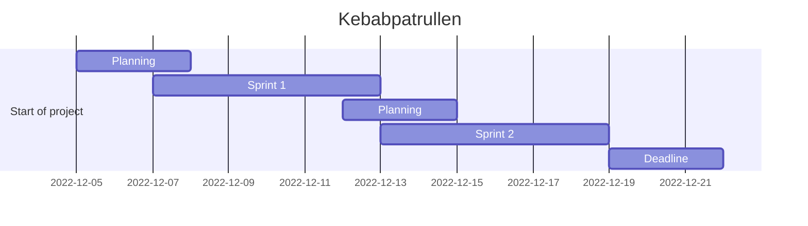
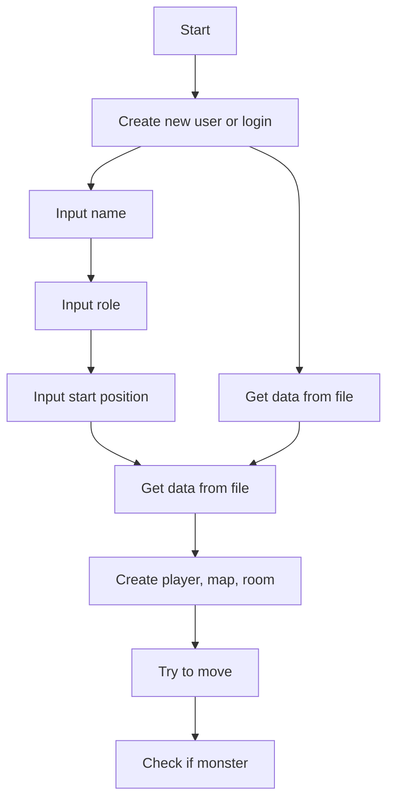

# Kebabpatrullen Agile Devops 2022

Let the search for the lost kebab begin!

---

## **Dungeon Run** - *In the search of the Lost Kebab*

Agile Project Management - DevOps22 - Team 5

Don't forget it's about the journey, not the destination.

---

## Shortcuts, Tips & Tricks

[**TODO**](stuff/todo.md)

[**Links**](stuff/links.md)

[**Tips & Tricks**](stuff/howto.md)

[**Story & Design**](stuff/story.md)

[**Trello Board**](https://trello.com/b/qFWLiZ49/kebabspelet)

[**Zoom Meeting**](https://zoom.us/j/97302349928?pwd=aFRwdVZNY3Ryekk4TnVPYnprNldUdz09)

---

## Dev Team

[*Frida*](https://github.com/fridalundstroms)

[*Mandana*](https://github.com/Manibadani)

[*Raffi*](https://github.com/raffiavakian)

[*Jarl*](https://github.com/JarlJakobsson)

[*Alex*](https://github.com/AlexRoman777)

---

## Support Team

[Robert WESTIN](https://github.com/robert-alfwar)

---

## Kanban Board

## Flowchart

## Project Timeline

---

---

## Agile roles

### **Scrum Roles**

- **Product Owner** - *Mandana*
- **Scrum Master** - *Frida*
- **Development Team** - *Raffi, Jarl, Alex*
- **Support Team** - *Robert*
- **Stakeholders** - *Robert*

### **Agile Roles**

---

## Mermaid from Flowchart

---

### Redoing the flowchart with mermaid

Work in progress 🚧

---

