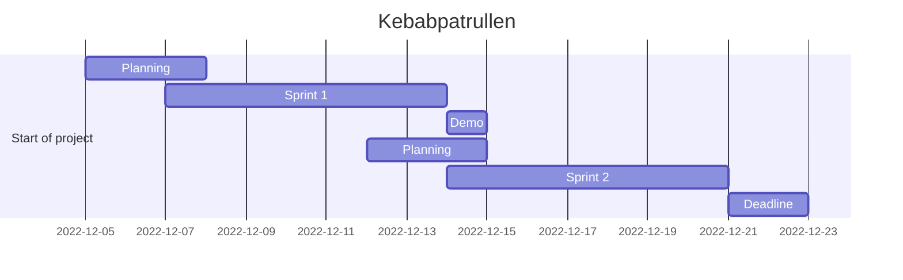

# Kebabpatrullen Agile Devops 2022

Let the search for the lost kebab begin!

 Ai generated art by <a href="https://www.openai.com/blog/dall-e/">OpenAI</a>

---

## **Dungeon Run** - _In the search of the Lost Kebab_

Agile Project Management - DevOps22 - Team 5

Team members: **Frida**, **Mandana**, **Raffi**, **Jarl**, **Alex**

Don't forget "it's about the journey, not the destination".</a>

---

## GUI - _Graphical User Interface_ 🚧

We focused our efforts on the terminal version of the game, but we also tryed to implement a GUI version of the game. The GUI version is not finished yet, but we are working on it. Maybe we will finish it on the next sprint 😀

[_Dungeon Run_ **GUI**](stuff/gui.md)

---

## Testing - _Unit Testing_ using _Pytest_ and _Unittest_

We have implemented unit testing for the game. We have used _Pytest_ and _Unittest_ to test the game. We have also implemented a coverage report to see how much of the code is covered by the tests.

[_Dungeon Run_ **Testing**](stuff/tests.md)

---

## Flowchart

We managed to create flowcharts for the game on 3 different ways. We used Lucidchart, Mermaid and Miro. Lucidchart and Miro are online tools, and Mermaid is a markdown extension. We used Lucidchart and Miro to create the flowcharts, and we used Mermaid to create the flowchart in this README file.

[_Dungeon Run_ **Flowchart**](stuff/flowchart.md)

---

## Kanban Board

We used Trello to create a Kanban board for the project. We used the Kanban board to manage the project and to keep track of the tasks. We also used the Kanban board for our sprint retrospectives.

[_Dungeon Run_ **Kanban Board**](stuff/kanban.md)

---

## Story & Design

[**Story & Design**](stuff/story.md)

---

## Daily Standup meeting links

Time: 10:00 - 10:30

[**Trello Board**](https://trello.com/b/qFWLiZ49/kebabspelet)

[**Zoom Meeting**](https://zoom.us/j/97302349928?pwd=aFRwdVZNY3Ryekk4TnVPYnprNldUdz09)

---

## Sprintperiod 1

Sprint Period 1 - Project Dungeon Run

| Name    | 07-Dec | 08-Dec | 09-Dec | 12-Dec | 13-Dec |
| ------- | ------ | ------ | ------ | ------ | ------ |
| Frida   | 3h     | 4h     | 7h     | 5h     | 5h     |
| Mandana | 3h     | 4h     | 7h     | 5h     | 5h     |
| Raffi   | 3h     | 4h     | 7h     | 5h     | 5h     |
| Jarl    | 3h     | 4h     | 7h     | 5h     | 5h     |
| Alex    | 3h     | 4h     | 7h     | 5h     | 5h     |
| Total   | 15h    | 20h    | 35h    | 25h    | 25h    |

---

## Sprintperiod 2

| Name    | Day 01 | Day 02 | Day 03 | Day 04 | Day 05 |
| ------- | ------ | ------ | ------ | ------ | ------ |
| Frida   | -      | -      | -      | -      | -      |
| Mandana | -      | -      | -      | -      | -      |
| Raffi   | -      | -      | -      | -      | -      |
| Jarl    | -      | -      | -      | -      | -      |
| Alex    | -      | -      | -      | -      | -      |
| Total   | -      | -      | -      | -      | -      |

---

## Journal

Daily journal for the project. (All team members) 🚧

| Date       | Description                                                                     | Time |
| ---------- | ------------------------------------------------------------------------------- | ---- |
| 2022-12-05 | Start of project. Info. Got the task                                            | 8h   |
| 2022-12-06 | Planning. Trello. Flowchart                                                     | 8h   |
| 2022-12-07 | Sprint 1. Backlog. Todo. Code for terminal version. Code for GUI                | 1h   |
| 2022-12-08 | Sprint 1. Timeplaning. Fibonaci. Standup                                        | 4h   |
| 2022-12-09 | Sprint 1. Standing. Show code. Team(pair) coding                                | 7h   |
| 2022-12-10 | Sprint 1. **Weekend**. PDF with timeplaning. New menu for terminal(proposition) | 4h   |
| 2022-12-11 | Sprint 1. **Weekend**. Testing with unittest and pytest.                        | 4h   |

[Back to top](#kebabpatrullen-agile-devops-2022)

---

## Dev Team

[_Frida_](https://github.com/fridalundstroms)

[_Mandana_](https://github.com/Manibadani)

[_Raffi_](https://github.com/raffiavakian)

[_Jarl_](https://github.com/JarlJakobsson)

[_Alex_](https://github.com/AlexRoman777)

---

## Support Team

[Robert WESTIN](https://github.com/robert-alfwar)

---

[Back to top](#kebabpatrullen-agile-devops-2022)

---

## Kanban Board

[Back to top](#kebabpatrullen-agile-devops-2022)

---

## Trello Sprint Backlog

[Back to top](#kebabpatrullen-agile-devops-2022)

---

## Flowchart

[Back to top](#kebabpatrullen-agile-devops-2022)

---

## Project Timeline - 🚧 _work in progress_ 🚧

[Back to top](#kebabpatrullen-agile-devops-2022)

---

## Agile roles

### **Roles**

We have to decide on the roles for the project.

- **Product Owner** - _Robert_
- **Scrum Master** - _Mandana_
- **Development Team** - _Alla_

[Back to top](#kebabpatrullen-agile-devops-2022)

---

[Back to top](#kebabpatrullen-agile-devops-2022)

---

## What's new?

[Robert's Sprint Demo Checklist](stuff/sprint_demo_checklist.md)

[_Dungeon Run_ **Testing**](stuff/testing.md)

[_Dungeon Run_ **Terminal Menu**](stuff/terminal_menu.md)

[Sprintperiod 1](#sprintperiod-1)

[Journals](#journal)

[Alex being Kebabmaster for a day](stuff/alex_agile.md)
