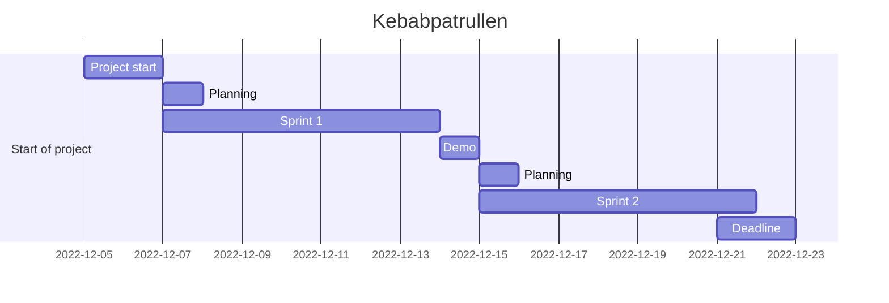

# Kebabpatrullen Agile Devops 2022

Let the search for the lost kebab begin!

<p align = "center">


<p align = "right"> generated art by <a href="https://openai.com/">OpenAI</a>

---

## **Raiders Of The Lost Kebab** - _In the search of the Lost Kebab_

Agile Project Management - DevOps22 - Team 5

Team members: [_Frida_](https://github.com/fridalundstroms), [_Mandana_](https://github.com/Manibadani), [_Raffi_](https://github.com/raffiavakian), [_Jarl_](https://github.com/JarlJakobsson), [_Alex_](https://github.com/AlexRoman777)

<p align = "right">Don't forget "it's about the journey, not the destination".</a>

---

## Requirements

The game was tested on Windows and Mac. It should work on Linux as well, but we have not tested it on Linux.
The only requirement is to have Python 3 installed on your computer. You can download Python 3 from [here](https://www.python.org/downloads/).

The only other requirement is to install the _Pygame_ library. You can install it by running the following command in your terminal:

```bash
pip install pygame
```

We use the _Pygame_ library to play sounds and music in the game.

For running the tests, you need to install the _Pytest_ library. You can install it by running the following command in your terminal:

```bash
pip install pytest
```

There is a requirements.txt file in the root directory of the project. You can install all the requirements by running the following command in your terminal:

```bash
pip install -r requirements.txt
```

Tox was used to run the tests on multiple Python versions. Tox is not required to run the game, but it is required to run the tests.

---

## How to run the game

To run the game, you need to open your terminal and navigate to the root directory of the project. Then you need to run the following command:

```bash
python main.py
```

or if you are using Linux/Mac:

```bash
python3 main.py
```

---

## GUI - _Graphical User Interface_ 🚧

We focused our efforts on the terminal version of the game, but we also tryed to implement a GUI version of the game. The GUI version is not finished yet, but we are working on it. Maybe we will finish it on the next sprint 😀

[_Raiders Of The Lost Kebab_ **GUI**](stuff/gui.md)

---

## Testing - _Unit Testing_ using _Pytest_ and _Unittest_

We have implemented unit testing for the game. We have used _Pytest_ and _Unittest_ to test the game. We have also implemented a coverage report to see how much of the code is covered by the tests.

[_Raiders Of The Lost Kebab_ **Testing**](stuff/tests.md)

---

## Flowchart

We managed to create flowcharts for the game on 3 different ways. We used Lucidchart, Mermaid and Miro. Lucidchart and Miro are online tools, and Mermaid is a markdown extension. We used Lucidchart and Miro to create the flowcharts, and we used Mermaid to create the flowchart in this README file.

[_Raiders Of The Lost Kebab_ **Flowchart**](stuff/flowchart.md)

---

## Kanban Board

We used Trello to create a Kanban board for the project. We used the Kanban board to manage the project and to keep track of the tasks. We also used the Kanban board for our sprint retrospectives.

[_Raiders Of The Lost Kebab_ **Kanban Board**](stuff/kanban.md)

---

## Story & Design

[**Story & Design**](stuff/story.md)

---

## Daily Standup meeting links

Time: 10:00 - 10:30

[**Trello Board**](https://trello.com/b/qFWLiZ49/kebabspelet)

[**Zoom Meeting**](https://zoom.us/j/97302349928?pwd=aFRwdVZNY3Ryekk4TnVPYnprNldUdz09)

---

## Sprint 1

Sprint Period 1 - Project Raiders Of The Lost Kebab

| Name    | 07-Dec | 08-Dec | 09-Dec | 12-Dec | 13-Dec |
| ------- | ------ | ------ | ------ | ------ | ------ |
| Frida   | 3h     | 4h     | 7h     | 5h     | 5h     |
| Mandana | 3h     | 4h     | 7h     | 5h     | 5h     |
| Raffi   | 3h     | 4h     | 7h     | 5h     | 5h     |
| Jarl    | 3h     | 4h     | 7h     | 5h     | 5h     |
| Alex    | 3h     | 4h     | 7h     | 5h     | 5h     |
| Total   | 15h    | 20h    | 35h    | 25h    | 25h    |

---

## Sprint 2

Sprint Period 2 - Project Raiders Of The Lost Kebab

| Name    | 14-Dec | 15-Dec | 16-Dec | 19-Dec | 20-Dec |
| ------- | ------ | ------ | ------ | ------ | ------ |
| Frida   | 6h     | 3h     | 4h     | 5h     | 7h     |
| Mandana | 6h     | 3h     | 4h     | 5h     | 7h     |
| Raffi   | 6h     | 3h     | 4h     | 5h     | 7h     |
| Jarl    | 6h     | 3h     | 4h     | 5h     | 7h     |
| Alex    | 6h     | 3h     | 4h     | 5h     | 7h     |
| Total   | 30h    | 15h    | 20h    | 25h    | 35h    |

---

[Back to top](#kebabpatrullen-agile-devops-2022)

---

## Project Timeline



---

[Back to top](#kebabpatrullen-agile-devops-2022)

---
