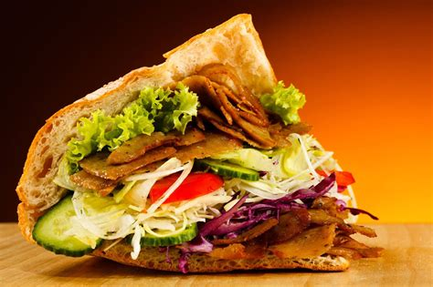
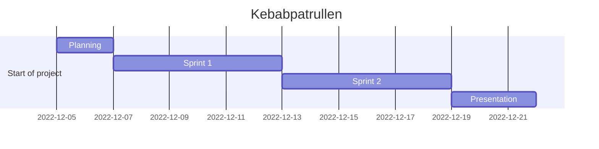
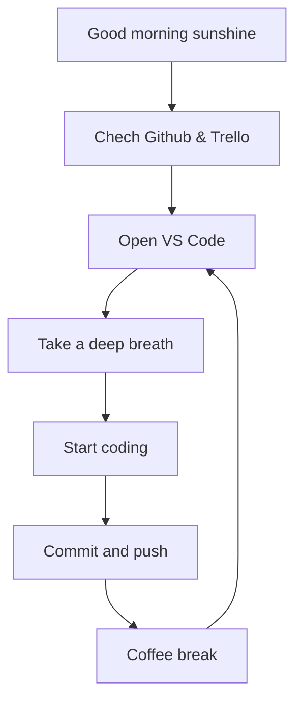

# Kebabpatrullen Agile Devops 2022

**Kebab** ON!
Let the kebab hunt begin!

---

## **Dungeon Run** - *In the search of the Lost Kebab*

Agile Project Management - DevOps22 - Team 5

Don't forget it's about the journey, not the destination.

---

[Trello Board](https://trello.com/invite/devops22gruppx/ATTI617b37ffc515008b88814c6b8f61e9ea09E661C5)

[Zoom](https://zoom.us/j/97302349928?pwd=aFRwdVZNY3Ryekk4TnVPYnprNldUdz09)

---

## Dev Team

[*Frida*](https://github.com/fridalundstroms)

[*Mandana*](https://github.com/Manibadani)

[*Raffi*](https://github.com/raffiavakian)

[*Jarl*](https://github.com/JarlJakobsson)

[*Alex*](https://github.com/AlexRoman777)

---

## Support Team

[Robert WESTIN](https://github.com/robert-alfwar)

---

## Good Stuff

[**TODO**](stuff/todo.md)

[**Links**](stuff/links.md)

## Flowchart

## Project Timeline

---

---

## Fun Diagrams

---

