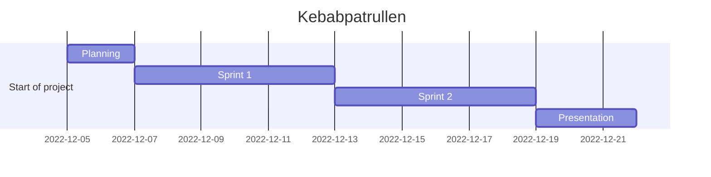
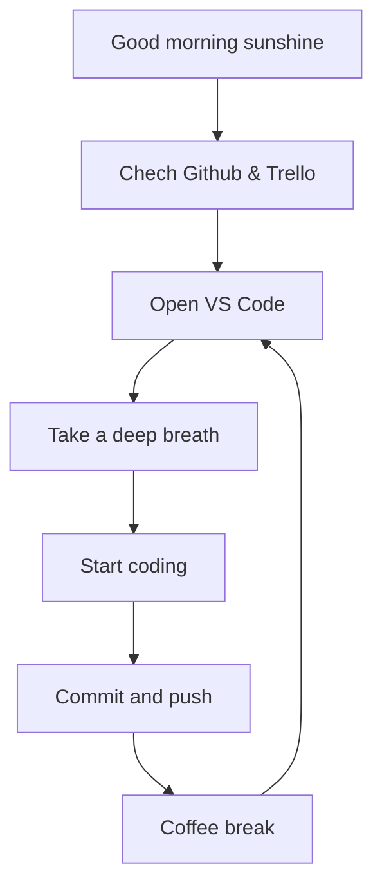

# Kebabpatrullen Agile Devops 2022

**Kebab** ON!
Let the kebab hunt begin!

---

## **Dungeon Run** - *In the search of the Lost Kebab*

Agile Project Management - DevOps22 - Team 5

Don't forget it's about the journey, not the destination.

---

[**Our Trello Board** *for planning and tracking progress*](https://trello.com/invite/devops22gruppx/ATTI617b37ffc515008b88814c6b8f61e9ea09E661C5)

---

## Dev Team

Please take the descriptions of the roles as a **joke**. We are all in this together and we will all do our best to make this project a success.
Please feel free to edit everything around here. No need to ask for permission. Any suggestions are welcome. This will NOT be our project README(*for now*). Just a fun front page.

[*Frida*](https://github.com/fridalundstroms) - Team Lead

[*Mandana*](https://github.com/Manibadani) - Scrum Master

[*Raffi*](https://github.com/raffiavakian) - Researcher, Designer & Story Writer

[*Jarl*](https://github.com/JarlJakobsson) - Lead Developer & Tech Lead

[*Alex*](https://github.com/AlexRoman777) - almost junior Developer

---

## Product Owner

[Robert WESTIN](https://github.com/robert-alfwar)

---

## Good Stuff

[**TODO**](stuff/todo.md)

[**Links**](stuff/links.md)

## Project Timeline

---

---

## Fun Diagrams

---

