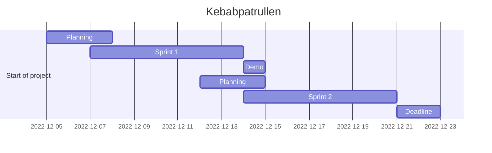

# Kebabpatrullen Agile Devops 2022

## **Dungeon Run** - _In the search of the Lost Kebab_

Agile Project Management - DevOps22 - Team 5

Let the search for the lost kebab begin!

---

## What's new?

- DevOps22 [**Betygskriterier**](stuff/betygskriterier.md)

- Game is now *playable in terminal* - Run `Game.py`

- Info about Agile [**Ceremonies**](stuff/ceremonies.md)

- Robert's [**Sprint Demo Checklist**](stuff/sprint_demo_checklist.md)

- Dungeon Run [**New Updated Testing**](stuff/testing.md)

---

## What's in plan for today?

- [ ] _Daily journal for the project._
- [ ] DevOps22 [**Betygskriterier**](stuff/betygskriterier.md)
- [ ] Info about Agile [**Ceremonies**](stuff/ceremonies.md)

---

## Already reviewed

- [Alex being Kebabmaster for a day](stuff/alex_agile.md)

- [Sprintperiod 1](#sprintperiod-1)

- [Journals](#journal) - _Daily journal for the project._ 

- **Sprint Game Demo** - _Demo of the game in terminal_

- **Sprint Demo** - _Describing the project, Process, Ceremonies, Trello Board, Roles, User Stories, Code_

---

## Stuff we will not use (at least for Sprint 1)

[_Dungeon Run_ **GUI**](stuff/gui.md)

[_Dungeon Run_ **Terminal Menu**](stuff/terminal_menu.md)

[_Dungeon Run_ **Testing**](stuff/testing.md)

---

## Play in terminal - _Coming soon_ ⏳

[_Dungeon Run_ **Terminal Demo**](stuff/terminal.md)

---

## Shortcuts, Tips & Tricks

[**TODO**](stuff/todo.md)

[**Links**](stuff/links.md)

[**Tips & Tricks**](stuff/howto.md)

[**Story & Design**](stuff/story.md)

[**Trello Board**](https://trello.com/b/qFWLiZ49/kebabspelet)

[**Zoom Meeting**](https://zoom.us/j/97302349928?pwd=aFRwdVZNY3Ryekk4TnVPYnprNldUdz09)

---

[Back to top](#kebabpatrullen-agile-devops-2022)

---

## Sprintperiod 1

Sprint Period 1 - Project Dungeon Run

| Name    | 07-Dec | 08-Dec | 09-Dec | 12-Dec | 13-Dec |
| ------- | ------ | ------ | ------ | ------ | ------ |
| Frida   | 3h     | 4h     | 7h     | 8h     | 5h     |
| Mandana | 3h     | 4h     | 7h     | 8h     | 5h     |
| Raffi   | 3h     | 4h     | 7h     | 8h     | 5h     |
| Jarl    | 3h     | 4h     | 7h     | 8h     | 5h     |
| Alex    | 3h     | 4h     | 7h     | 8h     | 5h     |
| Total   | 15h    | 20h    | 35h    | 40h    | 25h    |

---

## Sprintperiod 2

| Name    | Day 01 | Day 02 | Day 03 | Day 04 | Day 05 |
| ------- | ------ | ------ | ------ | ------ | ------ |
| Frida   | -      | -      | -      | -      | -      |
| Mandana | -      | -      | -      | -      | -      |
| Raffi   | -      | -      | -      | -      | -      |
| Jarl    | -      | -      | -      | -      | -      |
| Alex    | -      | -      | -      | -      | -      |
| Total   | -      | -      | -      | -      | -      |

[Back to top](#kebabpatrullen-agile-devops-2022)

---

## Dev Team

[_Frida_](https://github.com/fridalundstroms)

[_Mandana_](https://github.com/Manibadani)

[_Raffi_](https://github.com/raffiavakian)

[_Jarl_](https://github.com/JarlJakobsson)

[_Alex_](https://github.com/AlexRoman777)

---

## Support Team

[Robert WESTIN](https://github.com/robert-alfwar)

---

[Back to top](#kebabpatrullen-agile-devops-2022)

---

## Kanban Board

[Back to top](#kebabpatrullen-agile-devops-2022)

---

## Flowchart

[Back to top](#kebabpatrullen-agile-devops-2022)

---

## Project Timeline - 🚧 _work in progress_ 🚧

[Back to top](#kebabpatrullen-agile-devops-2022)

---

Don't forget it's about the journey, not the destination.

