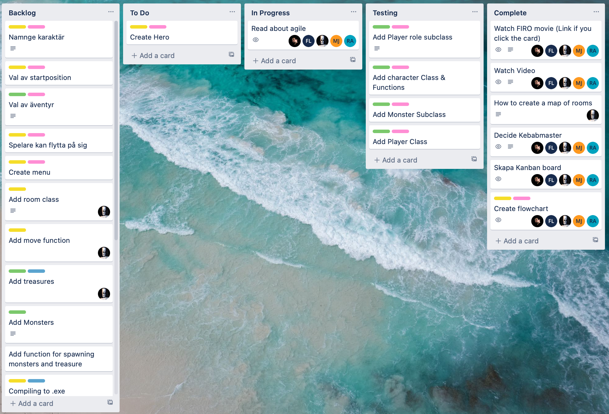
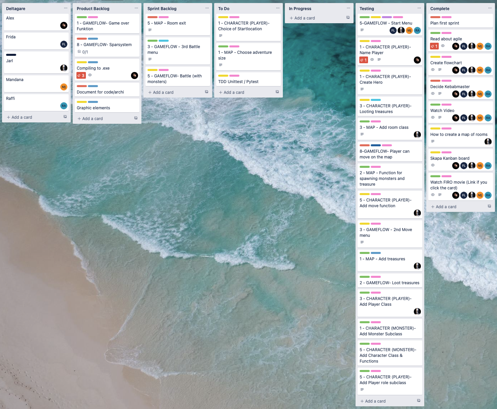
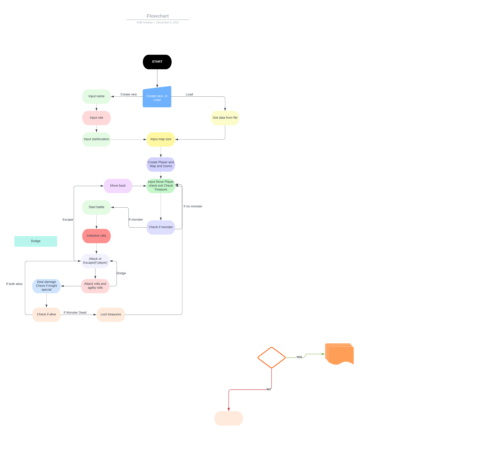
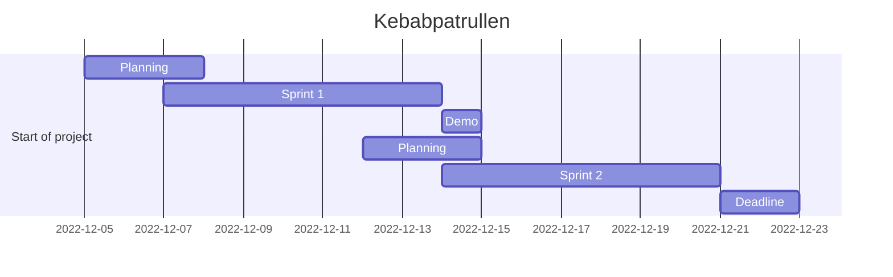
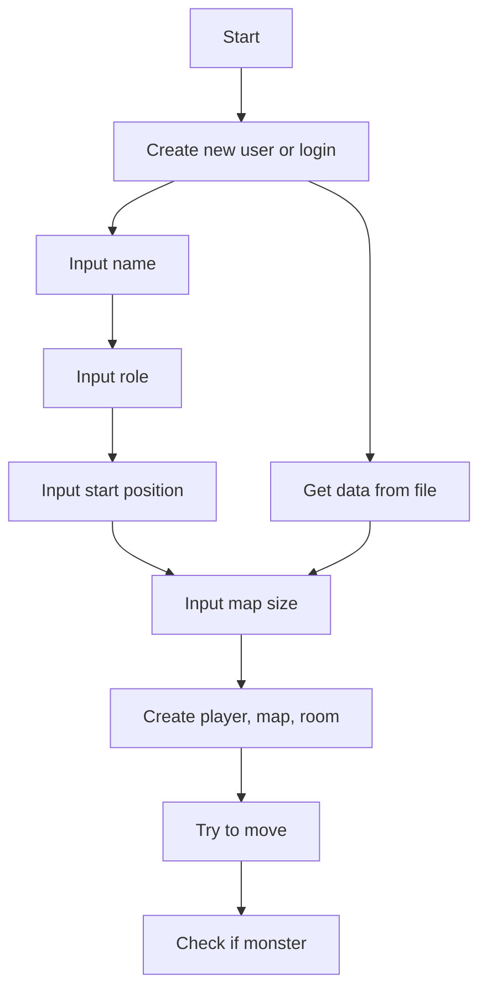

# Kebabpatrullen Agile Devops 2022

Let the search for the lost kebab begin!

---

## Important Notes

- For *Jarl*:

Please update the main branch with the latest code, so we can start [testing](stuff/testing.md)

---

## **Dungeon Run** - *In the search of the Lost Kebab*

Agile Project Management - DevOps22 - Team 5

Don't forget it's about the journey, not the destination.

---

## GUI - *Graphical User Interface* 🚧

[*Dungeon Run* **GUI**](stuff/gui.md)

---

## Testing - *Unit Testing* 🚧

[*Dungeon Run* **Testing**](stuff/testing.md)

---

## New terminal menu 🚧

[*Dungeon Run* **Terminal Menu**](stuff/terminal_menu.md)

---

## Play in terminal - *Coming soon* ⏳

[*Dungeon Run* **Terminal**](stuff/terminal.md)

---

## Shortcuts, Tips & Tricks

[**TODO**](stuff/todo.md)

[**Links**](stuff/links.md)

[**Tips & Tricks**](stuff/howto.md)

[**Story & Design**](stuff/story.md)

[**Trello Board**](https://trello.com/b/qFWLiZ49/kebabspelet)

[**Zoom Meeting**](https://zoom.us/j/97302349928?pwd=aFRwdVZNY3Ryekk4TnVPYnprNldUdz09)

---

## Sprintperiod 1

Sprint Period 1 - Project Dungeon Run

| Name | 07-Dec | 08-Dec | 09-Dec | 12-Dec | 13-Dec |
| --- | --- | --- | --- | --- | --- |
| Frida | 3h | 4h | 7h | 5h | 5h |
| Mandana | 3h | 4h | 7h | 5h | 5h |
| Raffi | 3h | 4h | 7h | 5h | 5h |
| Jarl | 3h | 4h | 7h | 5h | 5h |
| Alex | 3h | 4h | 7h | 5h | 5h |
| Total | 15h | 20h | 35h | 25h | 25h |

---

## Sprintperiod 2

| Name | Day 01 | Day 02 | Day 03 | Day 04 | Day 05 |
| --- | --- | --- | --- | --- | --- |
| Frida | - | - | - | - | - |
| Mandana | - | - | - | - | - |
| Raffi | - | - | - | - | - |
| Jarl | - | - | - | - | - |
| Alex | - | - | - | - | - |
| Total | - | - | - | - | - |

---

## Journal

Daily journal for the project. (All team members)

| Date | Description | Time |
| --- | --- | --- |
| 2022-12-05 | Start of project. Info. Got the task | 8h |
| 2022-12-06 | Planning. Trello. Flowchart | 8h |
| 2022-12-07 | Sprint 1. Backlog. Todo. Cod for terminal version. Code for GUI | 1h |
| 2022-12-08 | Sprint 1. Timeplaning. Fibonaci. Standup | 4h |
| 2022-12-09 | Sprint 1. Standing. Show code. Team(pair) coding | 7h |
| 2022-12-10 | Sprint 1. Weekend. Pdf with timeplaning. New menu for terminal(proposition) | 4h |
| 2022-12-11 | Sprint 1. Weekend. Testing with unittest and pytest.  | 4h |

---

## Dev Team

[*Frida*](https://github.com/fridalundstroms)

[*Mandana*](https://github.com/Manibadani)

[*Raffi*](https://github.com/raffiavakian)

[*Jarl*](https://github.com/JarlJakobsson)

[*Alex*](https://github.com/AlexRoman777)

---

## Support Team

[Robert WESTIN](https://github.com/robert-alfwar)

---

## Kanban Board

## Trello Sprint Backlog

## Flowchart

## Project Timeline

---

---

## Agile roles

### **Roles**

We have to decide on the roles for the project.

- **Product Owner** - *Robert*
- **Scrum Master** - *Mandana*
- **Development Team** - *Alla*

---

### Redoing the flowchart with mermaid

Work in progress 🚧

---

---

## Timeline PDF - by *Frida*

[**Timeline PDF**](stuff/sprint1.pdf)
