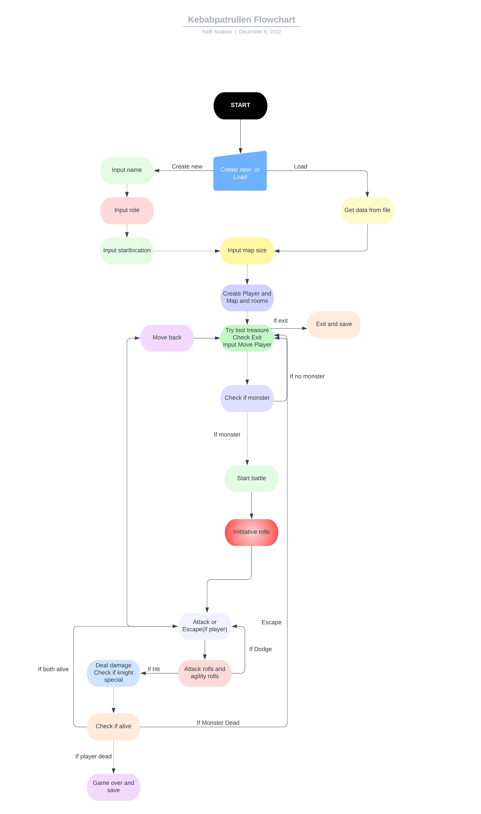

# Kebabpatrullen Agile Devops 2022

## **Raiders Of The Lost Kebab** - _In the search of the Lost Kebab_

Agile Project Management - DevOps22 - Team 5

Let the search for the lost kebab begin!

---

## What's new?

- DevOps22 [**Betygskriterier**](stuff/betygskriterier.md)

- Game is now *playable in terminal* - Run `game.py` or `main.py`

- Info about Agile [**Ceremonies**](stuff/ceremonies.md)

- Robert's [**Sprint Demo Checklist**](stuff/sprint_demo_checklist.md)

- Raiders Of The Lost Kebab [**New Updated Testing**](stuff/testing.md)

---

## Stuff we will not use (at least for Sprint 1)

[_Raiders Of The Lost Kebab_ **GUI**](stuff/gui.md)

[_Raiders Of The Lost Kebab_ **Terminal Menu**](stuff/terminal_menu.md)

[_Raiders Of The Lost Kebab_ **Testing**](stuff/testing.md)

---

## Play in terminal - _Coming soon_ ⏳

[_Raiders Of The Lost Kebab_ **Terminal Demo**](stuff/terminal.md)

---

## Shortcuts, Tips & Tricks

[**TODO**](stuff/todo.md)

[**Links**](stuff/links.md)

[**Story & Design**](stuff/story.md)

[**Trello Board**](https://trello.com/b/qFWLiZ49/kebabspelet)

[**Zoom Meeting**](https://zoom.us/j/97302349928?pwd=aFRwdVZNY3Ryekk4TnVPYnprNldUdz09)

---

[Back to top](#kebabpatrullen-agile-devops-2022)

---

## Sprintperiod 1

Sprint Period 1 - Project Dungeon Run

| Name    | 07-Dec | 08-Dec | 09-Dec | 12-Dec | 13-Dec |
| ------- | ------ | ------ | ------ | ------ | ------ |
| Frida   | 3h     | 4h     | 7h     | 8h     | 5h     |
| Mandana | 3h     | 4h     | 7h     | 8h     | 5h     |
| Raffi   | 3h     | 4h     | 7h     | 8h     | 5h     |
| Jarl    | 3h     | 4h     | 7h     | 8h     | 5h     |
| Alex    | 3h     | 4h     | 7h     | 8h     | 5h     |
| Total   | 15h    | 20h    | 35h    | 40h    | 25h    |

---

## Sprintperiod 2

| Name    | 14-Dec | 15-Dec | 16-Dec | 19-Dec | 20-Dec |
| ------- | ------ | ------ | ------ | ------ | ------ |
| Frida   | 6h     | 3h     | 4h     | 5h     | -      |
| Mandana | 6h     | 3h     | 4h     | 5h     | -      |
| Raffi   | 6h     | 3h     | 4h     | 5h     | -      |
| Jarl    | 6h     | 3h     | 4h     | 5h     | -      |
| Alex    | 6h     | 3h     | 4h     | 5h     | -      |
| Total   | 30h    | 15h    | 4h     | 25h    | -      |

[Back to top](#kebabpatrullen-agile-devops-2022)

---

## Dev Team

[_Frida_](https://github.com/fridalundstroms)

[_Mandana_](https://github.com/Manibadani)

[_Raffi_](https://github.com/raffiavakian)

[_Jarl_](https://github.com/JarlJakobsson)

[_Alex_](https://github.com/AlexRoman777)

---

## Support Team

[Robert WESTIN](https://github.com/robert-alfwar)

---

[Back to top](#kebabpatrullen-agile-devops-2022)

---

## Kanban Board

[Back to top](#kebabpatrullen-agile-devops-2022)

---

## Flowchart

[Back to top](#kebabpatrullen-agile-devops-2022)

---

## Project Timeline

[Back to top](#kebabpatrullen-agile-devops-2022)

---

Don't forget it's about the journey, not the destination.

