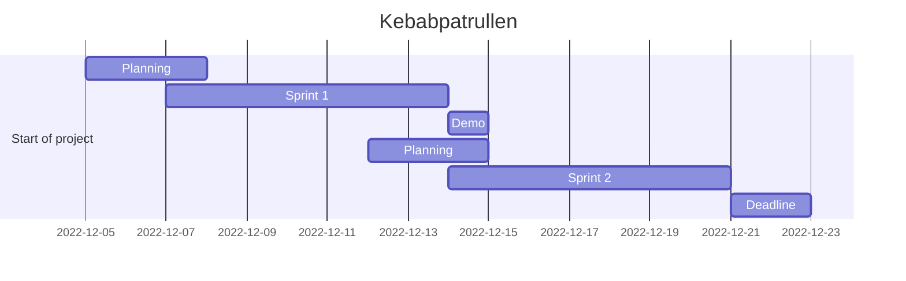

# Agile

## This will be our agile process if i have to take the lead (for a day) on this project

*We will decide on the next meeting what i'm proposing here.*

In my opinion because we don't really "**got**" all ideea behind Agile we are "**Agile**" only in name. To improve our team i will ask you do this (**Note**: *this is not mandatory*):

- *I will start working on this myself so don't feel obligated to do this.*
- I will delegate Frida to write the user stories. For that she will need to read the [requirements](dungeon_run.pdf) and also follow the [flowchart](#flowchart) then write the user stories.
- Mandana following Frida's user stories must write the acceptance criteria for the user stories. She will decide what is the acceptance criteria so the product owner will be happy with the result and also the dev team can be able to build. If Frida (during the week) or Robert (Sprint DEMO) want's too much Mandana will say **NO** hopefully, for the dev team's sake. 😃

---

- The user stories will be in the format:

>As a *role* i want to *do something* so that *i get something*.

Example:
>As a *customer* i want to *order a kebab* so that *i can eat it*.

Or in our case:

>As a *player* i want to *start the game* so that *i can play it*.

> As a *player* i want to *choose a character(hero)* so that *i can play the game as that character(hero)*.

> As a *player* i want to *move* so that *i can get to the next room*.

---

- The acceptance criteria will be in the format:

>Given *something* when *something happens* then *something happens*.

Example:

>Given *i am a customer* when *i order a kebab* then *i get a kebab*

Or in our case:

>Given *i am a player* when *i start the game* then *i get a menu*.

---

- In my opinion we can write user stories for every step in the game, following the flowchart. The stories must be small and simple, doing only one thing.

For example:

>As a *player* i want to *move* so that *i can get to the next room*.

>As a *player* i want to *fight a monster* so that *i can kill it*.

>As a *player* i want to *pick up a treasure* so that *i can become rich*. 😃

- Then Mandana can write the acceptance criteria for the user stories.
- Raffi can create/recreate the [kanban board](https://trello.com/b/qFWLiZ49/kebabspelet) and add the user stories to it. Togheter with Mandana can decide a backlog for the all project.

---

- Then we can have a sprint planning meeting (DID THIS ALREADY, here more like a theory) where we will decide what we will do in the sprint. We will have a sprint review meeting where we will show what we have done and then we will have a sprint retrospective meeting where we will discuss what we did well and what we can improve on. We will have a demo meeting where we will show the project to the customer (Robert) and then we will have a planning meeting where we will decide what we will do in the next sprint.
- We will have a daily scrum meeting where we will discuss what we did yesterday, what we will do today and if we have any blockers(problems that we can't solve, not exaclty our case as we are amaizing).

---

- Jarl and Alex will need to provide the code for the user stories.
- We need to provide a screenshot of the working code for the user stories.
For example:

>As a *player* i want to *choose a character(hero)* so that *i can play the game as that character(hero)*.

Then we have to provide a screenshot of the running game where the user can choose a character.

And we have to do this for every user story that we will write.

---

Then the rest like time estimation, sprint backlog, sprint review, sprint retrospective, demo, planning, daily scrum, kanban board, trello sprint backlog, flowchart, roles, timeline, etc. will be done by all of us.

[Back to top](#agile)

## Conclusion

I think that if we do this we will have a better understanding of Agile. Up until now if Robert wants to catch us unprepared he can easily prove that we are not Agile. With all the things that we did that's not enough. Raffi having more experience with Agile can help us with this.

## Roles

We have to decide on the roles for the project, but i will give my suggestions.

- **Product Owner** - *Robert* - After every sprint
- **Scrum Master** - *Mandana*
- **Product Owner - Stakeholder** - *Frida* - During the sprint
- **Trello Board Manager** - **Kebabmaster** - *Raffi*
- **Tech Lead - Senior Developer** - *Jarl*
- **GitHub Manager - Frontend - Junior Developer** - *Alex*

## Timeline

## Flowchart

[Back to top](#agile)

---

[Back to the main page](../README.md)
