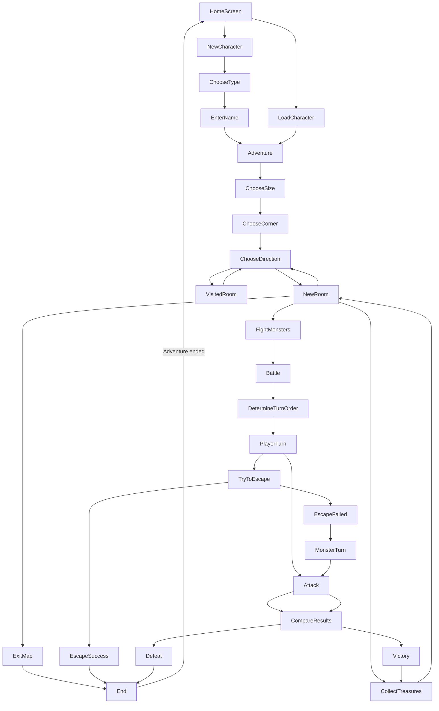
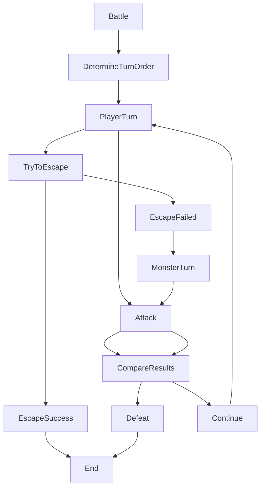

# Flowchart

We used Lucidchart, Miro and Mermaid to create the flowchart for the game. We prefer Lucidchart and Miro, but we used Mermaid to create the flowchart in this README file. Mermaid is a markdown extension, and it's easy to use but it's not as easy to learn as Lucidchart and Miro.

---

## Lucidchart Flowchart

Lucidchart is an online tool that we used to create the flowchart for the game. Our first flowchart:

<p align = "center">


---

## Miro Flowchart

Miro is an online tool that we used to create the flowchart for the game after we reached some limits on Lucid. Our second flowchart:

<p align = "center">


---

## Mermaid Flowchart

We used mermaid as we found mermaid to be useful for creating not only flowcharts but also other diagrams. We used mermaid to create the flowchart in this README file.



---

We used the following code for the above flowchart:

    ```mermaid
    graph TD;
        HomeScreen-->NewCharacter;
        HomeScreen-->LoadCharacter;
        NewCharacter-->ChooseType;
        ChooseType-->EnterName;
        EnterName-->Adventure;
        LoadCharacter-->Adventure;
        Adventure-->ChooseSize;
        ChooseSize-->ChooseCorner;
        ChooseCorner-->ChooseDirection;
        ChooseDirection-->NewRoom;
        NewRoom-->FightMonsters;
        NewRoom-->CollectTreasures;
        NewRoom-->ChooseDirection;
        NewRoom-->ExitMap;
        FightMonsters-->Battle;
        CollectTreasures-->NewRoom;
        ExitMap-->End;
        End-->|Adventure ended|HomeScreen;
        ChooseDirection-->VisitedRoom;
        VisitedRoom-->ChooseDirection;
        Battle-->DetermineTurnOrder;
        DetermineTurnOrder-->PlayerTurn;
        PlayerTurn-->Attack;
        PlayerTurn-->TryToEscape;
        Attack-->CompareResults;
        TryToEscape-->EscapeSuccess;
        TryToEscape-->EscapeFailed;
        EscapeSuccess-->End;
        EscapeFailed-->MonsterTurn;
        MonsterTurn-->Attack;
        Attack-->CompareResults;
        CompareResults-->Defeat;
        CompareResults-->Victory;
        Defeat-->End;
        Victory-->CollectTreasures;
    ```

---

## Example of Mermaid Flowchart for the battle system



---

Back to [Frontpage](../README.md)
