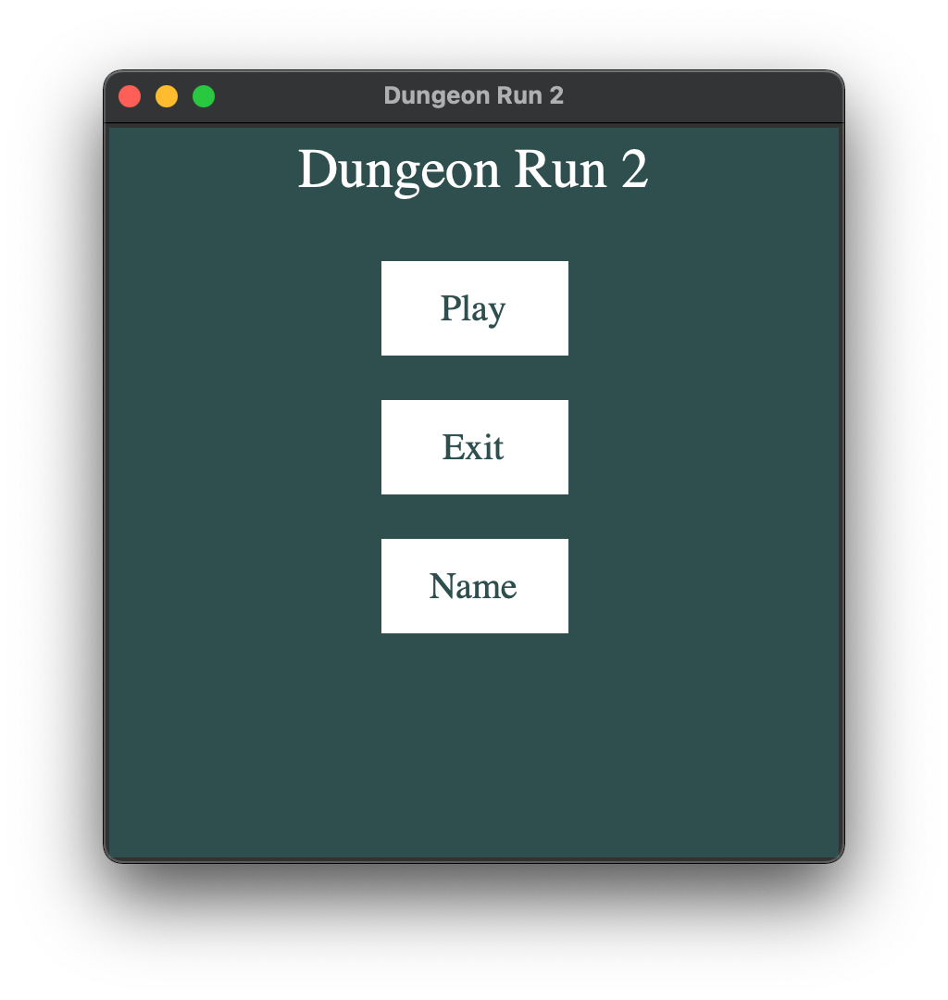
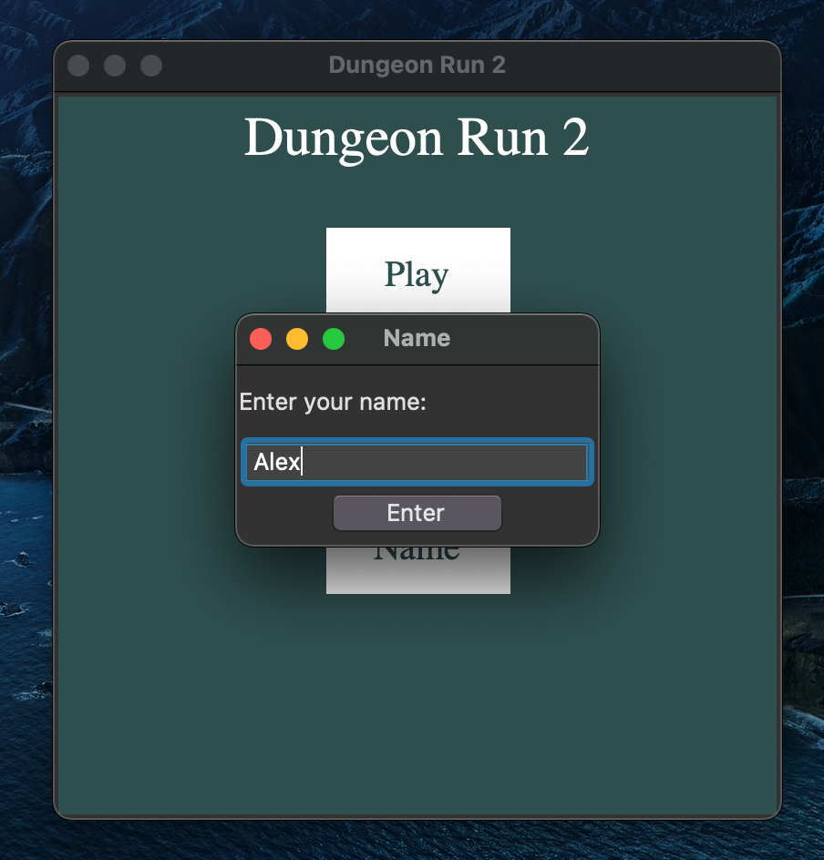
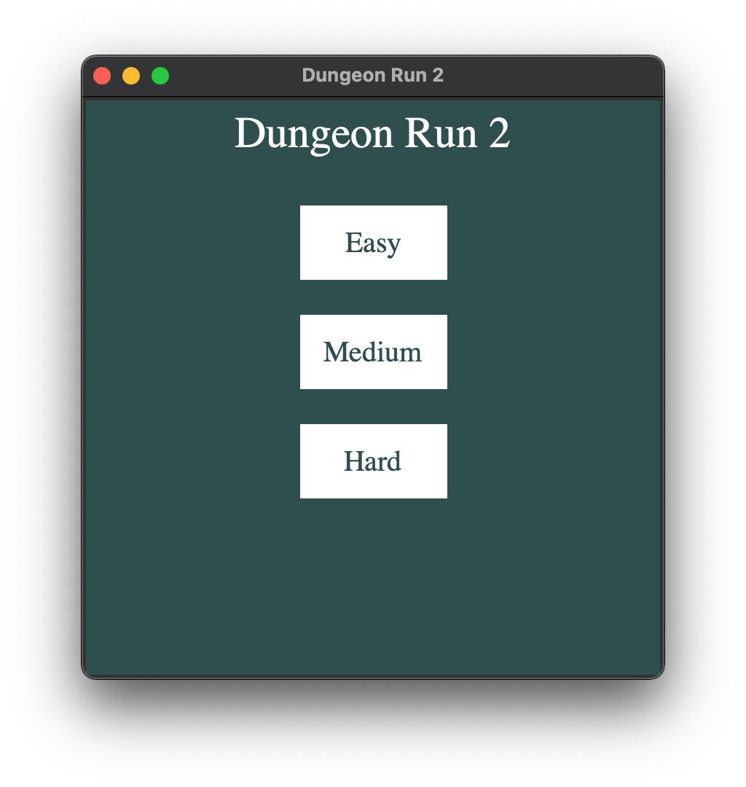
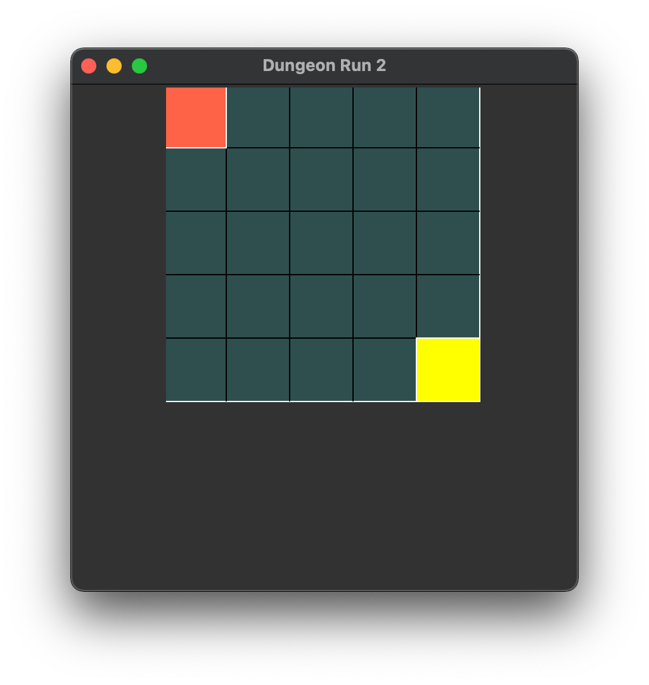
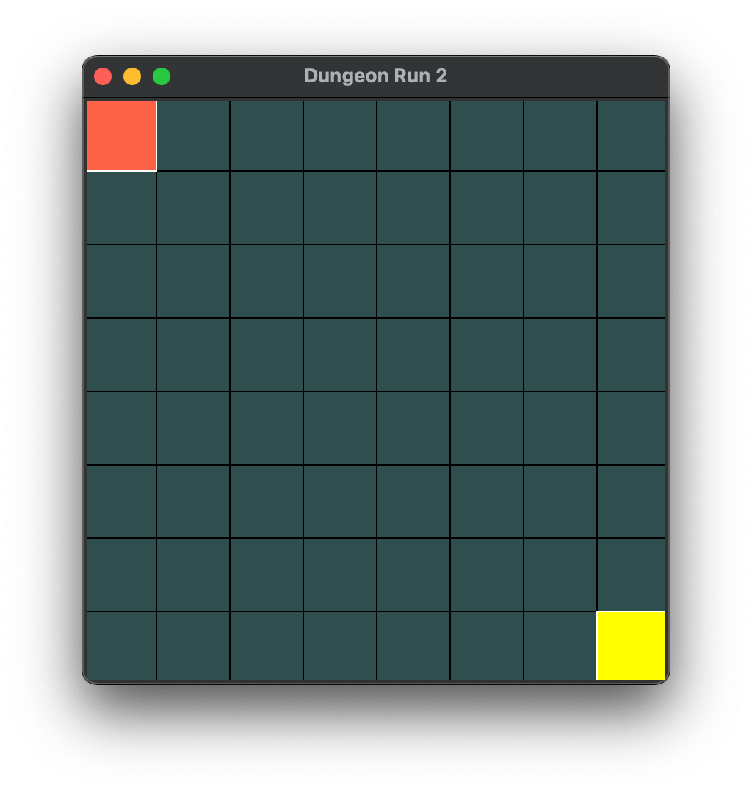
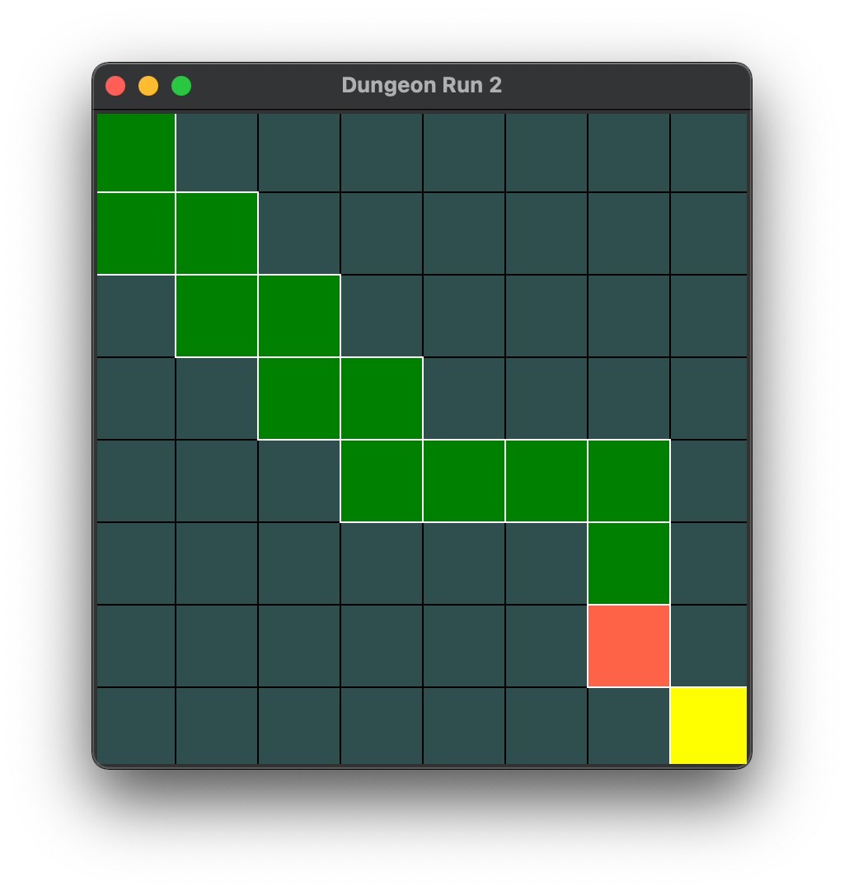

# Dungeon run GUI

Got to the version 3, still 6 more to go. 

Back to [Frontpage](../README.md)

---

## Main menu

The main menu is the first screen you see when you start the game. It has 3 buttons:

- **Play** - Starts a new game

- **Exit** - It does what it says ;)

- **Name** - Open a popup and ask for a name. Not the best placement but i was just testing it.

---

## Name popup

The name popup is a simple popup that asks for a name. This part is just a test, i will probably change it later.

- **Enter** - Accepts the name and closes the popup

---

## Difficulty menu

Here the player needs to decide the size of the dungeon. The size of the dungeon is the number of rooms in the dungeon. The bigger the dungeon, the harder the game. I will have to rename this menu later.

- **Easy** - Starts a new game with 4 x 4 rooms

- **Medium** - Starts a new game with 5 x 5 rooms

- **Hard** - Starts a new game with 8 x 8 rooms

---

## Easy, medium and hard

The player is in _red_, exit is _yellow_.
The root window stays the same, but the size of the dungeon changes. Before i was changing even the root but that was messing with the menu. So it will stay like this until i find a better solution.

---

## Pathway

The pathway is mostly a marker that shows the player where he has been.

---

## End of the dungeon

When the player reaches the end of the dungeon, the game ends. I will have to add a popup that says something like "You won!". For now the game will return to the [main menu](#main-menu).

---

Back to [Frontpage](../README.md)
