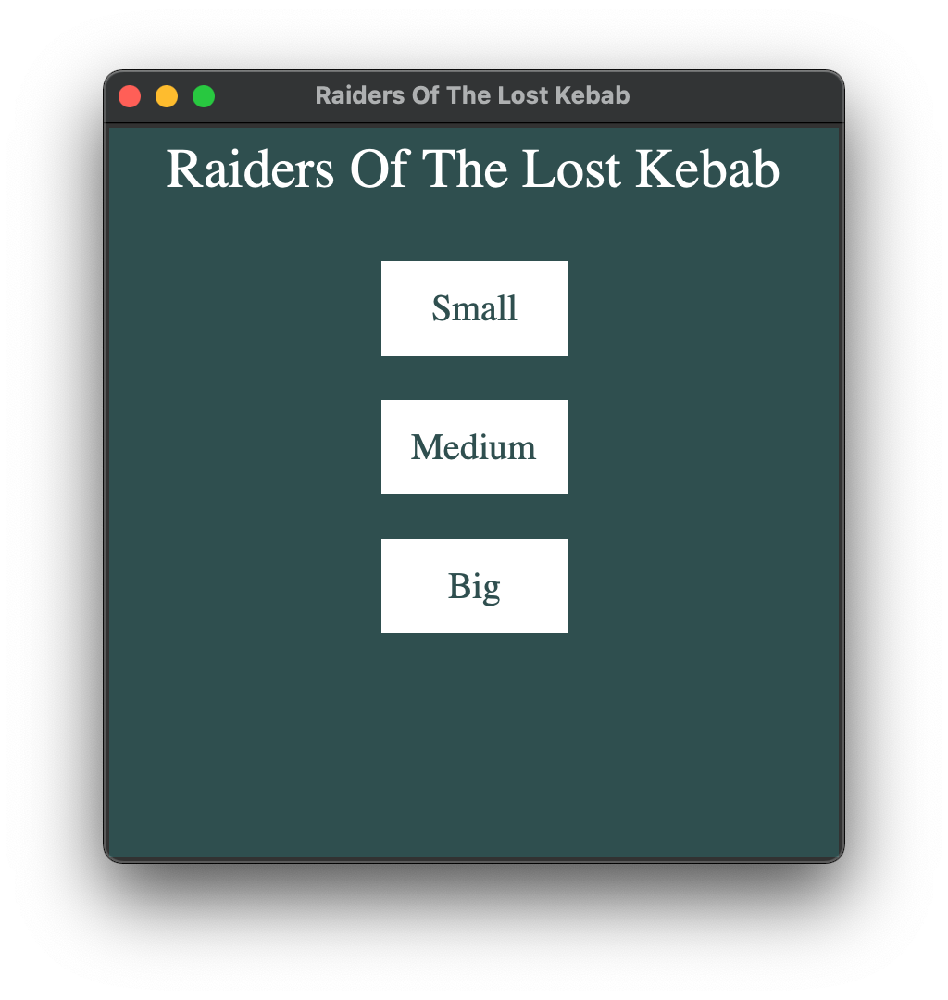

# Dungeon run GUI

Got to the version 3, still 6 more to go.

Back to [Frontpage](../README.md)

---

## Intro

---

## Main menu

---

## Name popup

---

## Choose map size

- **Small** - Starts a new game with 4 x 4 rooms

- **Medium** - Starts a new game with 5 x 5 rooms

- **Big** - Starts a new game with 8 x 8 rooms

---

## Easy, medium and hard

The player is in _red_, exit is _yellow_.
The root window stays the same, but the size of the dungeon changes. Before i was changing even the root but that was messing with the menu. So it will stay like this until i find a better solution.

---

## Pathway

The pathway is mostly a marker that shows the player where he has been.

---

## End of the dungeon

When the player reaches the end of the dungeon, the game ends. I will have to add a popup that says something like "You won!". For now the game will return to the [intro screen](#intro).

---

Back to [Frontpage](../README.md)
