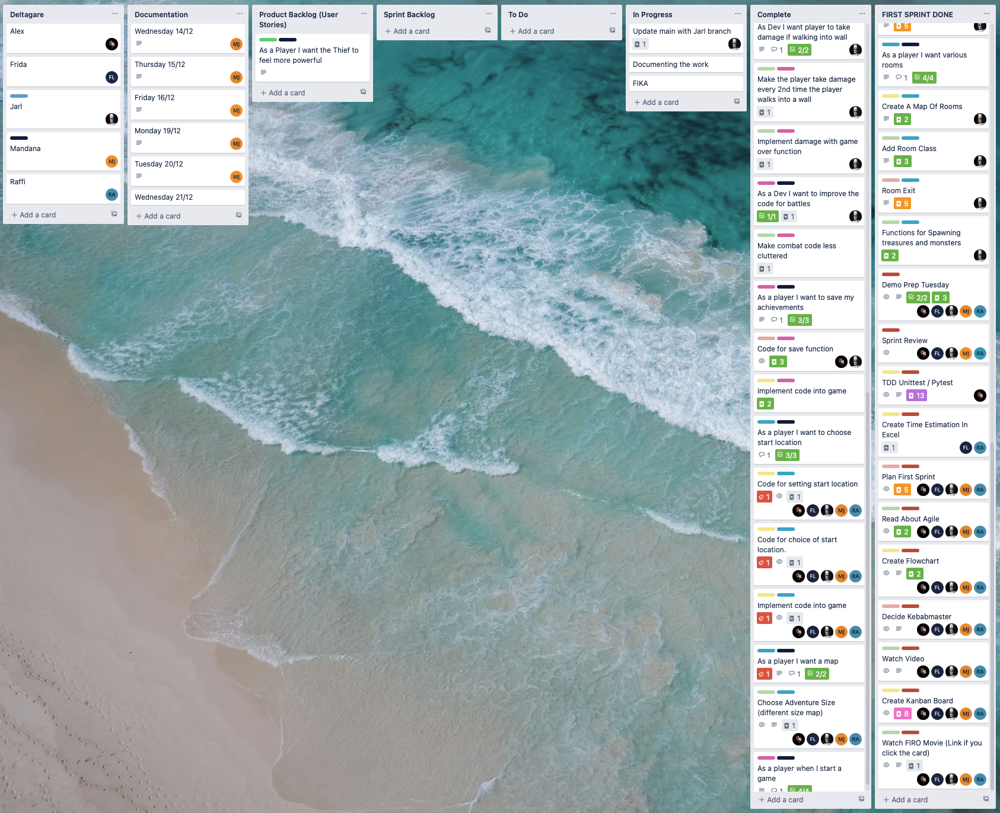
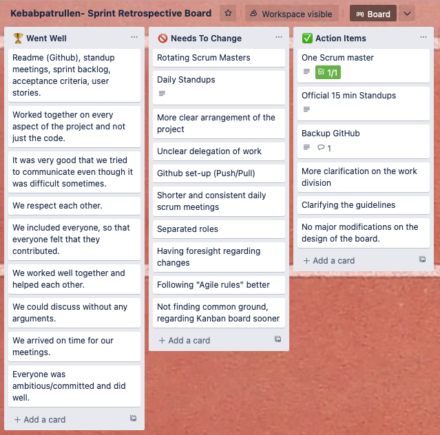
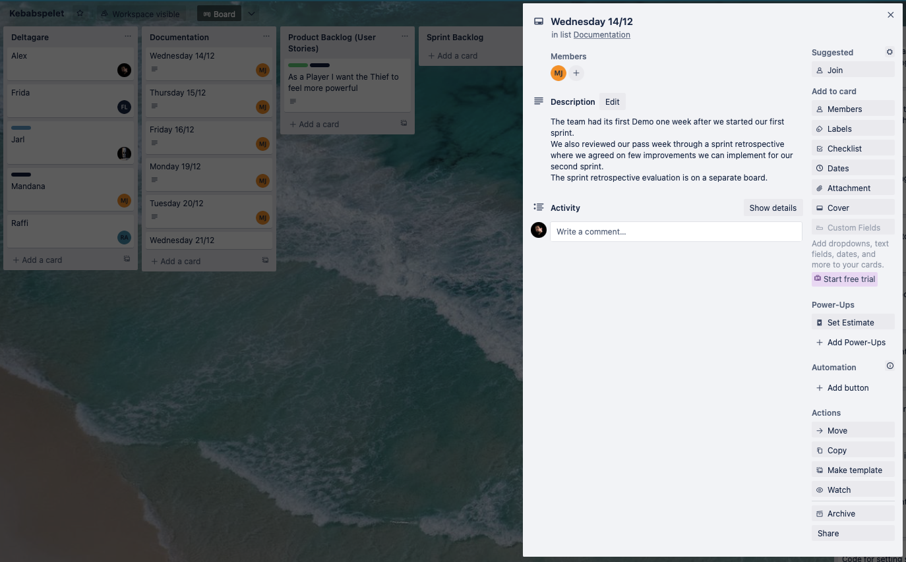

# Kanban Board

We used Trello to create a Kanban board for the project. The following images show the Kanban board at different stages of the project. Not exactly representing the actual time, but the order of the images is correct.

---

## First kanban board

This was before we figured out how to use Trello. We had a lot of columns and we didn't know how to use it.

---

## Second kanban board

This was after we figured out how to use Trello. We start creating the sprint 1 backlog.

---

## Trello Sprint 1 Backlog

This is the board at the end of sprint 1. We finally figured out about the shape of the board and how to use it.

---

## Trello Sprint 2 Backlog

This is the board at the end of sprint 2.

---

## Sprint 1 Retrospective

This is the retrospective for sprint 1. We used post-its to write down our thoughts and then we discussed them. After that we created a new kanban board with our new thoughts.

---

## Sprint 2 Retrospective

To be continued...

---

## Dayly Journal on Trello

We used Trello to keep track of our daily journal. We used the comments on the cards to write down what we did during the day.

---

Back to [Frontpage](../README.md)
