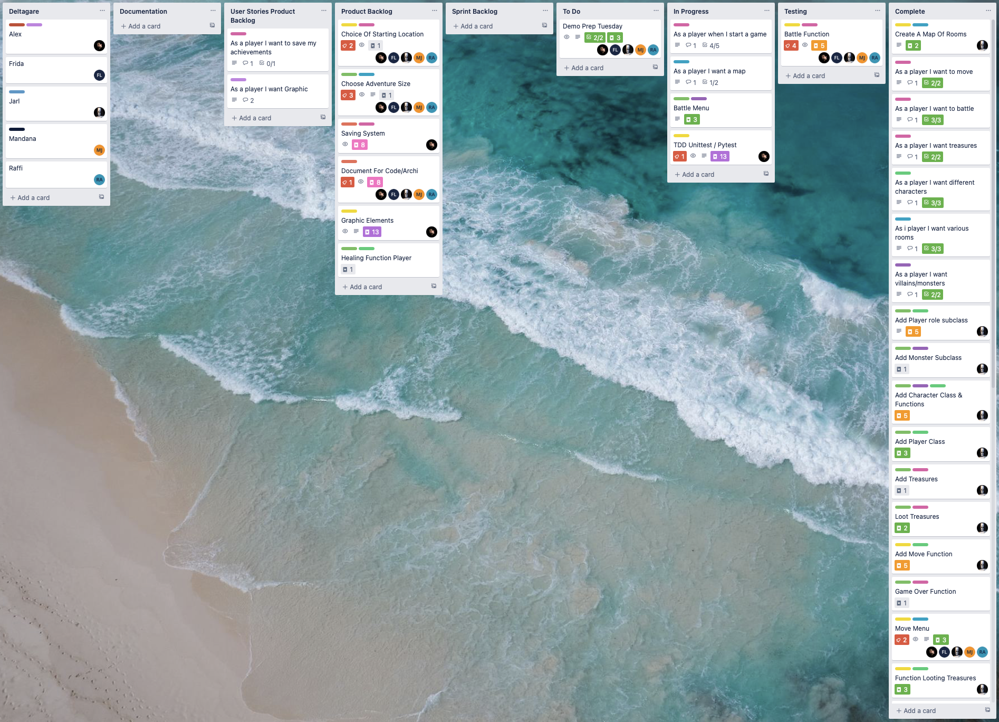
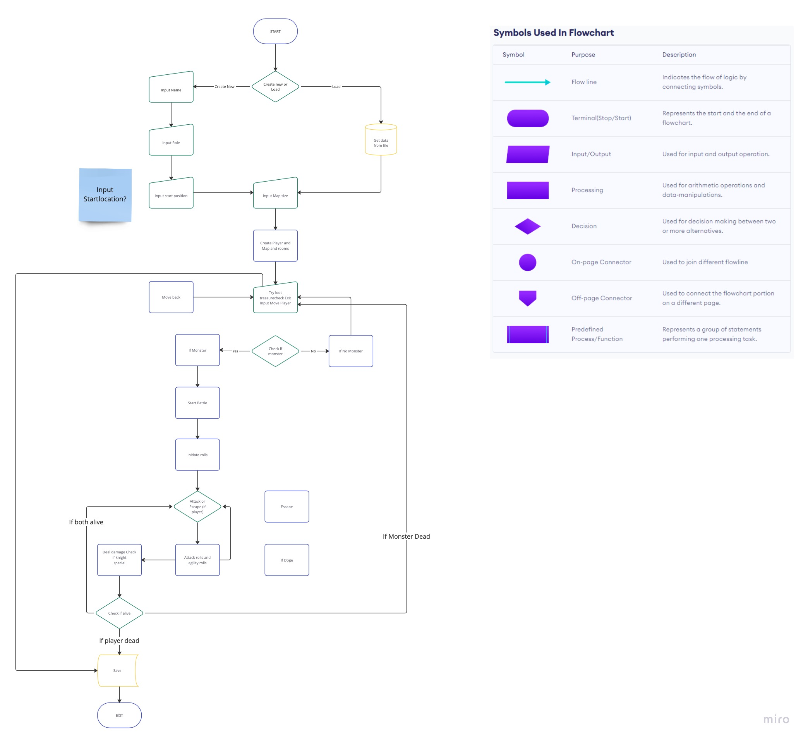
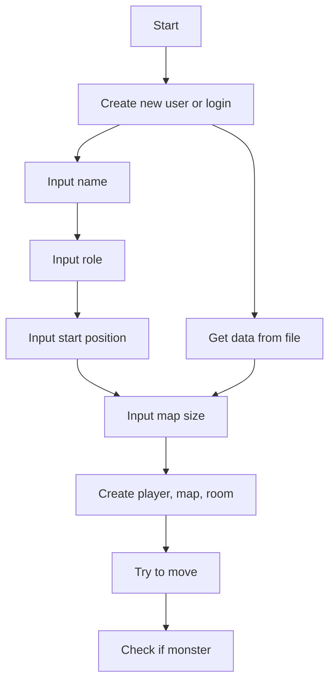
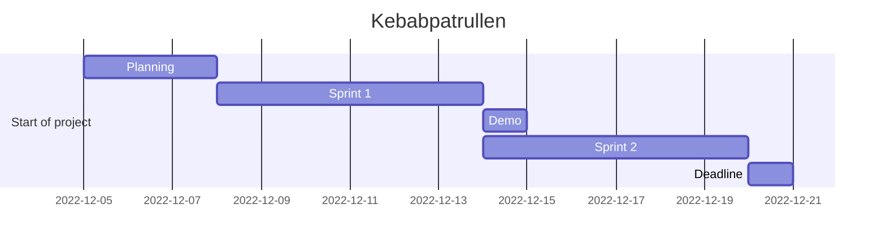
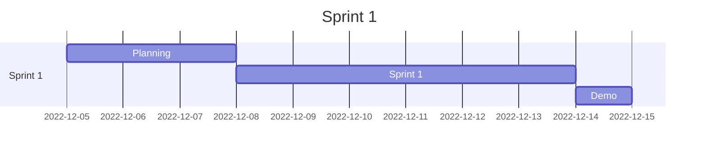
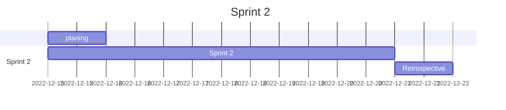

# Sprint Review (Demo) - Kebabpatrullen Agile Devops 2022

## **Dungeon Run** - _In the search of the Lost Kebab_

Agile Project Management - DevOps22 - Team 5

Let the search for the lost kebab begin!

---

Because of lack of knowledge about _Agile Development_, we started with a waterfall approach. We created a flowchart, kanban board and a project timeline. We also created a README.md and used github to collaborate on code and documentation.

But more we learned we realized that we needed to change our approach. We created a product backlog, a sprint backlog, user stories and a sprint review and retrospective. We used Trello to create the kanban board and to keep track of our progress. We used Miro, Lucid and Mermaid to create the flowchart and the project timeline. We used github to collaborate on code, link sharing, updates and documentation.

---

## Short summary of the project

### What we did

- [x] Created a flowchart following the game design document
- [x] Created a project timeline
- [x] Created a README.md a short summary of the project and updates
- [x] Created a product backlog
- [x] Created a sprint backlog
- [x] Created user stories
- [x] Created a sprint review
- [x] Created a sprint retrospective

---

## Kanban boards

---

### First Kanban board

---

### Start of Sprint 1

---

### End of Sprint 1

---

## Flowcharts

---

### First Flowchart - using Lucidchart

---

### Second Flowchart - using Miro

---

### Third Flowchart - using Mermaid 🚧

---

## Project Timeline

### Timeline - using Mermaid

---

## Agile roles

For a while we broke to rules and did changed the roles dayly so everybody could get a feel for the roles. But after finding everyone's strenghts and weaknesses we decided to keep the roles for the rest of the project in the following way:

1. As a **Stakeholder** we chose **Robert**
2. As a **Scrum Master** we chose **Mandana**
3. As a **Product Owner** we chose **Frida**
4. As a **Development Team** we chose **Jarl**, **Raffi** and **Alex**

We also decided:

- to have a daily scrum meeting at 10:00 every morning
- to have a sprint review and retrospective every week
- to have a sprint planning meeting every week
- to have a sprint backlog and a product backlog
- to have a kanban board and all team members should update it daily

---

- Stakeholder's role is to make sure that the project is going in the right direction and that the project is going to be a success.
- The Scrum Master role is to make sure that the team is working together and that the team is following the rules.
- The Product Owner is responsible for the product backlog, the sprint backlog and user stories.
- The Development Team is responsible for the code and the documentation.

---

### Stakeholder - **_Robert_**

### Scrum Master - **_Mandana_**

### Product Owner - **_Frida_**

### Development Team - **_Jarl, Raffi, Alex_**

---

## Product Backlog

- The Product Owner togheter with Scrum Master and Stakeholder created the product backlog. The product backlog is a list of all the features that we want to have in the game. The product backlog is ordered by priority.

## User Stories

- The Scrum Master and Product Owner created the user stories. The user stories are short descriptions of the features in the product backlog. The user stories are ordered by priority.

## Sprint Backlog

- The development team togheter with Scrum Master created the sprint backlog. The sprint backlog is a list of all the features that we want to have in the game for the current sprint. The sprint backlog is ordered by priority.

## Sprint Review

- The Scrum Master, Product Owner and Dev Team created the sprint review. The sprint review is a short summary of the sprint and what we have done with a demo of the game in current state.

## Sprint Retrospective

- The sprint retrospective will be a short summary of what we have done well and what we could have done better and will be created by the Scrum Master, Product Owner and Dev Team after the sprint review.

---

## Sprint 1

### Sprint 1 - using Mermaid

---

## Sprint 1 Retrospective

### What we did well

- We did a good job with the flowchart and the project timeline.

- We did a good job with the kanban board and the sprint backlog.

- We did a good job with the user stories.

- We did a good job creating acceptance criteria for the user stories.

- We manage to create a README.md and to use github to collaborate on code and documentation.

- We manage to meet every day at 10:00 for the daily scrum meeting on Zoom and Discord.

- We worked well toghehter as a team.

- We split the work so that everybody had something to do.

- We managed to agree on the time estimation for the user stories by using the fibonacci sequence(poker planning).

- We collaborated well on the code.

- Worked togheter on every aspect of the project and not just the code.

### What we could have done better

- We could have done a better job following the agile "rules".

- We (I 😁) could have done a better job studying about the Agile methodology since day 1. 🧐

- We could have find sooner the common ground for the kanban board design.

- Separating the roles better and not change them every day, in the beginning. (New team members, not used to the roles, took a while to find the right roles for everyone.)

- Let the Dev Team do more work on the code. (We did a lot of work on the code, but we could have done more.)

- Shorter and consistent daily scrum meetings.

---

## Dayly Scrum Meeting

### Questions for the daily scrum meetings

- What did you do yesterday?

- What will you do today?

- What is in your way?

- Who is responsible for what?

- Who needs help?

- What is the status of the project?

- Are we on track?

- Is the time estimation correct?

---

## Sprint 2

### Sprint 2 - using Mermaid

