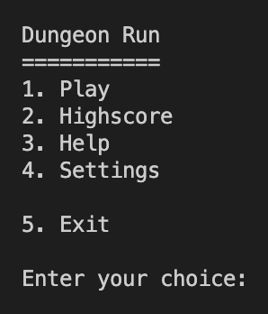

# Sprint Review (Demo) - Kebabpatrullen Agile Devops 2022

## **Dungeon Run** - _In the search of the Lost Kebab_

Agile Project Management - DevOps22 - Team 5

<p align = "center">


<p align = "center">Let the search for the lost kebab begin!</p>

---

## Table of Contents

- [Sprint Review (Demo) - Kebabpatrullen Agile Devops 2022](#sprint-review-demo---kebabpatrullen-agile-devops-2022)
  - [**Dungeon Run** - _In the search of the Lost Kebab_](#dungeon-run---in-the-search-of-the-lost-kebab)
  - [Table of Contents](#table-of-contents)
  - [Short summary of the project](#short-summary-of-the-project)
    - [What we did](#what-we-did)
  - [Kanban boards](#kanban-boards)
    - [First Kanban board](#first-kanban-board)
    - [Start of Sprint 1](#start-of-sprint-1)
    - [End of Sprint 1](#end-of-sprint-1)
  - [Flowcharts](#flowcharts)
    - [First Flowchart - using Lucidchart](#first-flowchart---using-lucidchart)
    - [Second Flowchart - using Miro](#second-flowchart---using-miro)
    - [Third Flowchart - using Mermaid 🚧](#third-flowchart---using-mermaid-)
  - [Project Timeline](#project-timeline)
    - [Timeline - using Mermaid](#timeline---using-mermaid)
  - [Agile roles](#agile-roles)
    - [Stakeholder - **_Robert_**](#stakeholder---robert)
    - [Scrum Master - **_Mandana_**](#scrum-master---mandana)
    - [Product Owner - **_Frida_**](#product-owner---frida)
    - [Development Team - **_Jarl, Raffi, Alex_**](#development-team---jarl-raffi-alex)
  - [Product Backlog](#product-backlog)
  - [User Stories](#user-stories)
  - [Sprint Backlog](#sprint-backlog)
  - [Sprint Review](#sprint-review)
  - [Sprint Retrospective](#sprint-retrospective)
  - [Sprint 1](#sprint-1)
    - [Sprint 1 - using Mermaid](#sprint-1---using-mermaid)
  - [Sprint 1 Retrospective](#sprint-1-retrospective)
    - [What we did well](#what-we-did-well)
    - [What we could have done better](#what-we-could-have-done-better)
  - [Dayly Scrum Meeting](#dayly-scrum-meeting)
    - [Questions for the daily scrum meetings](#questions-for-the-daily-scrum-meetings)
  - [Sprint 2](#sprint-2)
    - [Sprint 2 - using Mermaid](#sprint-2---using-mermaid)
  - [Time](#time)
  - [Journal](#journal)
  - [Screenshots](#screenshots)
    - [Splash Screen](#splash-screen)
    - [Main Menu](#main-menu)
    - [TDD - Test Driven Development](#tdd---test-driven-development)
    - [Code](#code)
    - [User Story \& Acceptance Criteria](#user-story--acceptance-criteria)
    - [In file documentation](#in-file-documentation)
  - [Fun and Games](#fun-and-games)

---

## Short summary of the project

We created a product backlog, a sprint backlog, user stories and a sprint review and retrospective. We used Trello to create the kanban board and to keep track of our progress. We used Miro, Lucid and Mermaid to create the flowchart and the project timeline. We used github to collaborate on code, link sharing, updates and documentation.

### What we did

- [x] Created a flowchart following the game design document
- [x] Created a project timeline
- [x] Created a README.md with a short summary of the project and updates
- [x] Created a product backlog
- [x] Created a sprint backlog
- [x] Created user stories
- [x] Created a sprint review
- [x] Created a sprint retrospective
- [x] Created a sprint 1
- [x] Stand up meetings every day at 10:00

---

## Kanban boards

---

### First Kanban board

<p align = "center">


[Back to TOC](#table-of-contents)

---

### Start of Sprint 1

<p align = "center">


[Back to TOC](#table-of-contents)

---

### End of Sprint 1

<p align = "center">


[Back to TOC](#table-of-contents)

---

## Flowcharts

---

### First Flowchart - using Lucidchart

<p align = "center">


[Back to TOC](#table-of-contents)

---

### Second Flowchart - using Miro

<p align = "center">


[Back to TOC](#table-of-contents)

---

### Third Flowchart - using Mermaid 🚧


[Back to TOC](#table-of-contents)

---

## Project Timeline

### Timeline - using Mermaid


[Back to TOC](#table-of-contents)

---

## Agile roles

For a while we broke to rules and did changed the roles dayly so everybody could get a feel for the roles. But after finding everyone's strenghts and weaknesses we decided to keep the roles for the rest of the project in the following way:

1. As a **Stakeholder** we chose **Robert**
2. As a **Scrum Master** we chose **Mandana**
3. As a **Product Owner** we chose **Frida**
4. As a **Development Team** we chose **Jarl**, **Raffi** and **Alex**

We also decided:

- to have a daily scrum meeting at 10:00 every morning
- to have a sprint review and retrospective every week
- to have a sprint planning meeting every week
- to have a sprint backlog and a product backlog
- to have a kanban board and all team members should update it daily

---

- Stakeholder's role is to make sure that the project is going in the right direction and that the project is going to be a success.
- The Scrum Master role is to make sure that the team is working together and that the team is following the rules.
- The Product Owner is responsible for the product backlog, the sprint backlog and user stories.
- The Development Team is responsible for the code and the documentation.

---

### Stakeholder - **_Robert_**

### Scrum Master - **_Mandana_**

### Product Owner - **_Frida_**

### Development Team - **_Jarl, Raffi, Alex_**

[Back to TOC](#table-of-contents)

---

## Product Backlog

- The Product Owner togheter with Scrum Master and Stakeholder created the product backlog. The product backlog is a list of all the features that we want to have in the game. The product backlog is ordered by priority.

## User Stories

- The Scrum Master and Product Owner created the user stories. The user stories are short descriptions of the features in the product backlog. The user stories are ordered by priority.

## Sprint Backlog

- The development team togheter with Scrum Master created the sprint backlog. The sprint backlog is a list of all the features that we want to have in the game for the current sprint. The sprint backlog is ordered by priority.

## Sprint Review

- The Scrum Master, Product Owner and Dev Team created the sprint review. The sprint review is a short summary of the sprint and what we have done with a demo of the game in current state.

## Sprint Retrospective

- The sprint retrospective will be a short summary of what we have done well and what we could have done better and will be created by the Scrum Master, Product Owner and Dev Team after the sprint review.

[Back to TOC](#table-of-contents)

---

## Sprint 1

### Sprint 1 - using Mermaid


[Back to TOC](#table-of-contents)

---

## Sprint 1 Retrospective

### What we did well

- We did a good job with the flowchart and the project timeline.

- We did a good job with the kanban board and the sprint backlog.

- We did a good job with the user stories.

- We did a good job creating acceptance criteria for the user stories.

- We manage to create a README.md and to use github to collaborate on code and documentation.

- We manage to meet every day at 10:00 for the daily scrum meeting on Zoom and Discord.

- We worked well toghehter as a team.

- We split the work so that everybody had something to do.

- We managed to agree on the time estimation for the user stories by using the fibonacci sequence(poker planning).

- We collaborated well on the code.

- Worked togheter on every aspect of the project and not just the code.

### What we could have done better

- We could have done a better job following the agile "rules".

- We (I 😁) could have done a better job studying about the Agile methodology since day 1. 🧐

- We could have find sooner the common ground for the kanban board design.

- Separating the roles better and not change them every day, in the beginning. (New team members, not used to the roles, took a while to find the right roles for everyone.)

- Let the Dev Team do more work on the code. (We did a lot of work on the code, but we could have done more.)

- Shorter and consistent daily scrum meetings.

---

## Dayly Scrum Meeting

### Questions for the daily scrum meetings

- What did you do yesterday?

- What will you do today?

- What is in your way?

- Who is responsible for what?

- Who needs help?

- What is the status of the project?

- Are we on track?

- Is the time estimation correct?

[Back to TOC](#table-of-contents)

---

## Sprint 2

### Sprint 2 - using Mermaid


---

[Back to TOC](#table-of-contents)

---

## Time

Sprint Period 1 - Project Dungeon Run

| Name    | 07-Dec | 08-Dec | 09-Dec | 12-Dec | 13-Dec |
| ------- | ------ | ------ | ------ | ------ | ------ |
| Frida   | 3h     | 4h     | 7h     | 8h     | 5h     |
| Mandana | 3h     | 4h     | 7h     | 8h     | 5h     |
| Raffi   | 3h     | 4h     | 7h     | 8h     | 5h     |
| Jarl    | 3h     | 4h     | 7h     | 8h     | 5h     |
| Alex    | 3h     | 4h     | 7h     | 8h     | 5h     |
| Total   | 15h    | 20h    | 35h    | 40h    | 25h    |

---

## Journal

Daily journal for the project.

| Date       | Description                                                                                 | Time |
| ---------- | ------------------------------------------------------------------------------------------- | ---- |
| 2022-12-05 | Start of project. Info. Got the task                                                        | 8h   |
| 2022-12-06 | Planning. Trello. Flowchart                                                                 | 8h   |
| 2022-12-07 | Sprint 1. Backlog. Todo. Code for terminal version. Code for GUI                            | 1h   |
| 2022-12-08 | Sprint 1. Timeplaning. Fibonaci. Standup                                                    | 4h   |
| 2022-12-09 | Sprint 1. Standing. Show code. Team(pair) coding                                            | 7h   |
| 2022-12-10 | Sprint 1. **Weekend**. PDF with timeplaning. New menu for terminal(proposition)             | 4h   |
| 2022-12-11 | Sprint 1. **Weekend**. Testing with unittest and pytest.                                    | 4h   |
| 2022-12-12 | Sprint 1. In class. User stories, Trello, Code Debuging. Redone Testing | 8h   |
| 2022-12-13 | Sprint 1. On zoom. Acceptance Criteria, Trello updateting, Code Debuging. Add more testing to the updated code | 5h   |
| 2022-12-14 | End Sprint 1. In class. Demo - Sprint Review | 4h   |

---

[Back to TOC](#table-of-contents)

---

## Screenshots

---

### Splash Screen

<p align = "center">


---

### Main Menu

<p align = "center">


<p align = "center">


<p align = "center">


---

### TDD - Test Driven Development

<p align = "center">


``` python
def test_get_user_input(self):
    """Test get user input."""
    with patch("builtins.input", return_value="test"):
        assert self.game.get_user_input() == "test"
```

[Back to TOC](#table-of-contents)

---

### Code

```python
class Giantspider(Character):
    def __init__(self):
        super().__init__()
        self.initiative = 7
        self.health = 1
        self.attack = 2
        self.agility = 3
        self.max_health = 1
        self.name = "Giant Spider"
```

---

### User Story & Acceptance Criteria

```gherkin
As a customer i want to order a kebab so that i can eat it.
```

```gherkin
Given i am a customer when i order a kebab then i get a kebab.
```

---

### In file documentation

```python
def get_user_input(self):
    """Get user input from the terminal.

    Returns:
        str: The user input.
    """
    return input()
```

```python
def clear():
    """Clears the screen in terminal, works on all OS"""
    os.system('cls' if os.name == 'nt' else 'clear')
```

---

## Fun and Games

<p align = "center">


[Story](story.md)

---

[Back to TOC](#table-of-contents)

---

[Back to the main page](../README.md)