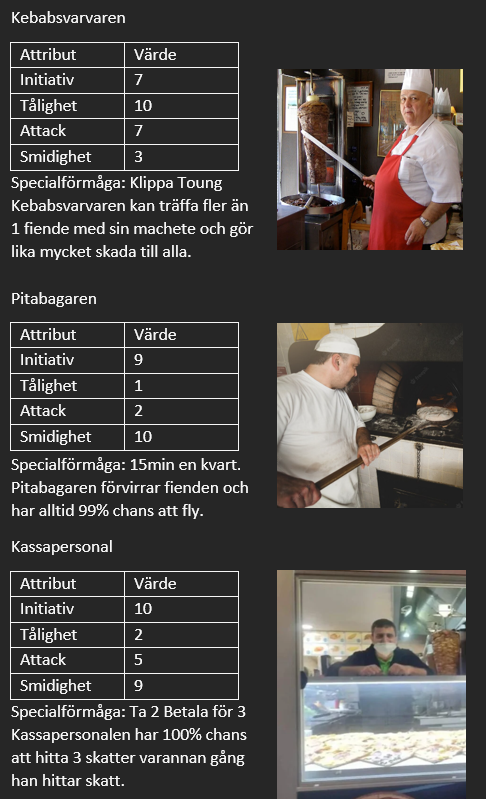
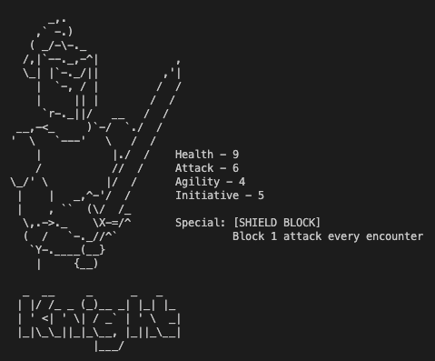
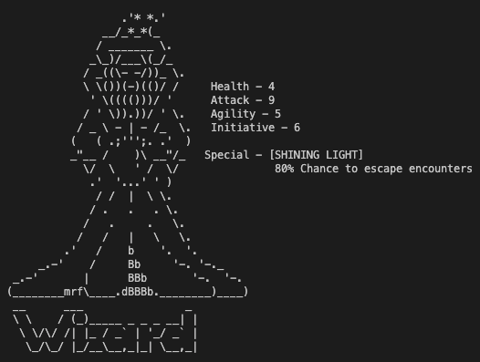
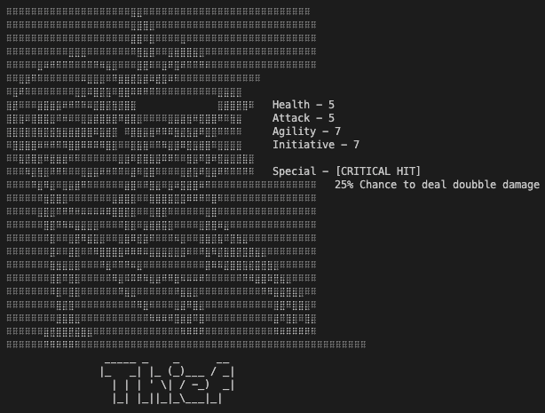
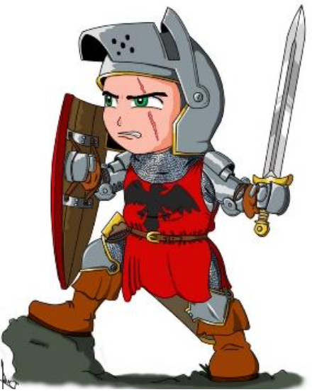
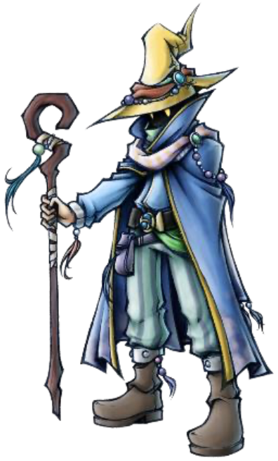
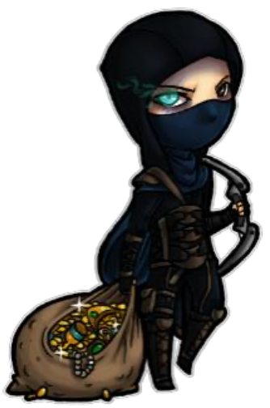

# Design

## New splash screen

---

## Heroes

---

## Story

You are an adventurer, who has been hired by the king to find the lost kebab. The kebab has been missing for a long time, and the king is desperate to find it. The king has promised you a lot of gold if you find the kebab. You have been given a map, and you are now on your way to find the lost kebab.

---

## Riddles

    " Nånting händer
      Det är nåt skumt på gång
      Men våra vänner
      De grillar dagen lång
      Och de finns i trakten här omkring
      Vill du ha kebab så ring
      Här kommer världens bästa kebabpatrull
      Som svarvar kebaben för din skull "

                                                - Kebabpatrullen's Hungry Artist

---

## First logo

---

## Ascii art

### Knight

---

### Wizard

---

### Thief

---

### Intro

---

## Heroes from the design paper

### Knight

---

### Wizard

---

### Thief

---

## Design

[Design paper in english](game.md)

[Original Dungeon Run - PDF](dungeon_run.pdf)

---

Back to [Frontpage](../README.md)
