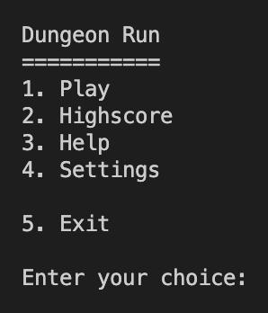
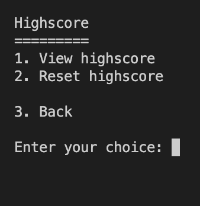
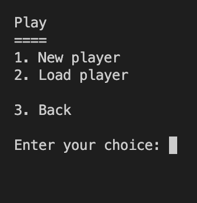
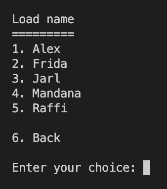
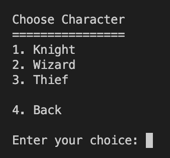
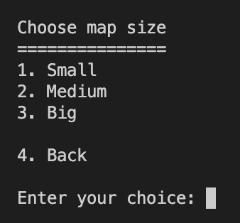
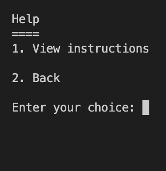

# A new menu

I lost some time on this menu some months ago, i used for my Battleship game. I changed a bit for our game. Next step is to add the directions and the fight menu. Not necesssary to use this but if need it is here.

## Some screenshots - not in order

---

---

---

Back to [Frontpage](../README.md)
