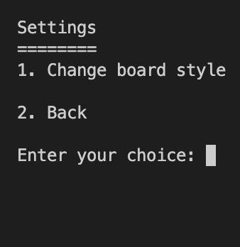
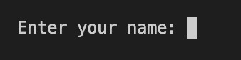

# A new menu - just a proposal or a plan B

I lost some time on this menu some months ago, i used for my Battleship game.

I changed a bit for our game.

 Next step is to add the directions and the fight menu. Also forgot about the starting position.

 Not necesssary to use this but if need it is here.

 More to come...

---

## To run the menu

The files are located in the folder `utils`. Run `menu.py` in your VSCode.

---

## Some screenshots - not in order

---

---

---

Back to [Frontpage](../README.md)
