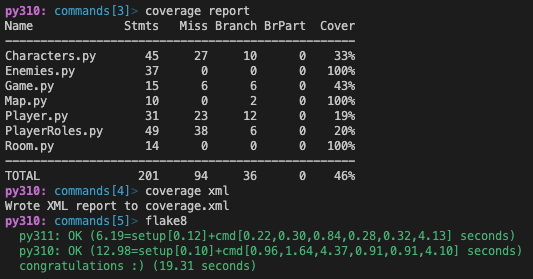

# Geting the virtual environment set up

I set up the environment for testing with TOX. We will use both Pytest and Unittest. Not an expert in either but I think it's a good idea to use both.
The tests are located in the `tests` folder

---

## Testing

I start testing but i'm sure i don't have the last version of the code. I run into class innit missing positons and other errors. I will try again after the code is updated.
And plase come with ideeas for more tests. Like i told you **i'm not an expert** in testing and also i got a **G** on my slutupgift just because *i didn't have enough tests*.

---

## Setup the virtual environment - venv and requirements.txt (for tox)

These are Robert's instructions:

1. Create a virtual environment
2. Install requirements

### Virtual environment (venv)

see <https://docs.python.org/3/library/venv.html>

Linux / OSX

```sh
python -m venv .venv  # could also be python3
source .venv/bin/activate
```

Windows - cmd.exe

```bat
python -m venv .venv
.venv\Scripts\activate.bat
```

Windows - PowerShell

```PowerShell
# On Microsoft Windows, it may be required to enable the Activate.ps1 script by setting the execution policy for the user. You can do this by issuing the following PowerShell command:
# Set-ExecutionPolicy -ExecutionPolicy RemoteSigned -Scope CurrentUser

py -m venv .venv
.\.venv\Scripts\Activate.ps1

```

### Install requirements.txt

```bat
pip install -r requirements.txt
```

## What i did on my mac

- `python3 -m venv venv`
- `source .venv/bin/activate`
- `pip install -r requirements.txt`

---

## Tox

I'm using Python 3.11 but in requiremts.txt I put both 3.11 and 3.10 so it will not matter what version you have installed.
But i recommand you to upgrade to 3.11, is faster and the error messages are better.

- run `tox` in the terminal

---

## Pytest

- run `tox` in the terminal

Or next command if you don't want to use tox:

- run `pytest` in the terminal

---

## Unittest

- run `tox` in the terminal

Or next command if you don't want to use tox:

- run `python3 -m unittest` in the terminal on mac
- run `py -m unittest` in the terminal on windows

---

## .vscode settings

```json
{
  "python.testing.pytestArgs": ["tests"],
  "python.testing.unittestEnabled": false,
  "python.testing.pytestEnabled": true,
  "editor.formatOnSave": true,
  "python.linting.enabled": true,
  "python.linting.flake8Enabled": true,
  "python.formatting.provider": "autopep8"
}
```

---

## Unittest test example

```python
class TestEnemies(unittest.TestCase):
    def test_Giantspider(self):
        self.assertEqual(Giantspider().initiative, 7)
        self.assertEqual(Giantspider().health, 1)
        self.assertEqual(Giantspider().attack, 2)
        self.assertEqual(Giantspider().agility, 3)
        self.assertEqual(Giantspider().max_health, 1)
        self.assertEqual(Giantspider().name, "Giant Spider")
```

---

## Pytest test example

```python
def test_Character():
    assert Character().is_alive is True
    assert Character().initiative == 0
    assert Character().health == 0
    assert Character().attack == 0
    assert Character().agility == 0
    assert Character().name == ""
    assert Character().max_health == 0
```

---

## Coverage report

- run `coverage run -m pytest` in the terminal

- run `coverage report` in the terminal

<p align = "center">



Back to [Frontpage](../README.md)