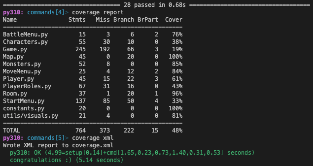

# TDD - Test Driven Development

We used TDD to develop the code. We didn't totally follow the TDD process but we tried at least once to write the test first and then the code. We used Pytest and Unittest. After we wrote the code we used coverage to see how much of the code was tested. We aim to get over 80% coverage. 

---

## Setup the virtual environment - venv and requirements.txt (for tox)

These are Robert's [instructions](testing.md) on how to set up the virtual environment for testing.

---

## Tests and coverage

We used both Pytest and Unittest. Not an expert in either but I think it's a good idea to use both. The tests are located in the `tests` folder.

---

### Pytest

Some examples of Pytest tests:

```python
def test_mark_player_position(map):
    map.mark_player_position((1, 1))
    assert map.map[1][1].name == "P"
```

```python
@mock.patch("MoveMenu.input", side_effect=["w", "s", "a", "d", "q"])
def test_run_menu(mock_input):
    move_menu = Move_menu()
    move_menu.run_menu()
    assert move_menu.direction == (-1, 0)

    move_menu.run_menu()
    assert move_menu.direction == (1, 0)

    move_menu.run_menu()
    assert move_menu.direction == (0, -1)

    move_menu.run_menu()
    assert move_menu.direction == (0, 1)

    move_menu.run_menu()
    assert move_menu.quit is True
```

---

### Unittest

Some examples of Unittest tests:

```python
class TestStart_menu(unittest.TestCase):
    def setUp(self):
        self.menu = Start_menu()

    def test_choose_name(self):
        with patch('builtins.input', return_value='Test'):
            self.menu.choose_name()
            self.assertEqual(self.menu.name, 'Test')
```

### Coverage

Old coverage report: We tested the code with Pytest and Unittest. We used coverage to see how much of the code was tested. We aim to get over 80% coverage. We also used coverage to see which lines of code that wasn't tested. We added tests for the lines that wasn't tested.

<p align = "center">


---

Last coverage report: As the code become more complex we had to add more tests. We also had to change some of the tests.

<p align = "center">


---

Back to [Frontpage](../README.md)
