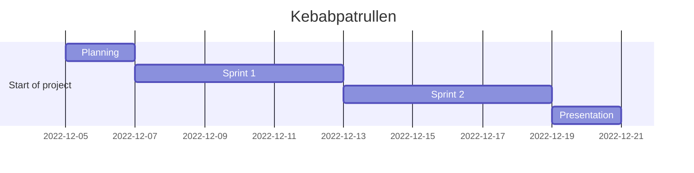

# Agile Project Management

Feel free to edit everything around here. No need to ask for permission.
Things from to do can be moved around. Any suggestions are welcome.

---

## **Dungeon Run** - *In the search of the Lost Kebab*

## Todo

- [ ] Create a new branch with your name and work there then pull request to main
- [ ] Add more stuff to this list
- [ ] Journal (daily) individual or team.
- [ ] Maybe a google doc with a story line?

---

## In Progress

- [ ] Trying to play the AGILE game
- [ ] Github repo
- [ ] Planning
- [x] Having fun!

---

## Done

- [x] Fix a zoom meeting [Zoom](https://zoom.us/j/97302349928?pwd=aFRwdVZNY3Ryekk4TnVPYnprNldUdz09)
- [x] Planning
- [x] Roles
- [x] Github repo
- [X] Trello board
- [X] README.md
- [X] Links.md
- [X] Todo.md
- [X] Agree on tomorrow's meeting
- [x] Schetch some mermaid basic diagrams
- [x] Start the fun!

---

## Mermaid Diagrams

---

Back to [Frontpage](../README.md)
