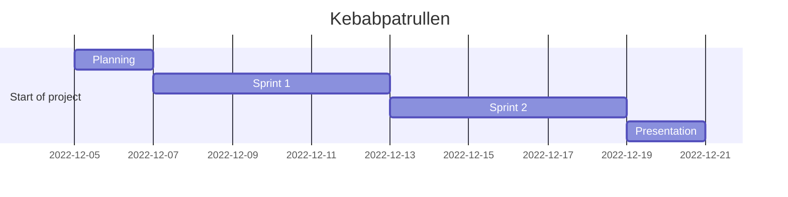

# Agile Project Management

Feel free to edit everything around here. No need to ask for permission.
Things from to do can be moved around. Any suggestions are welcome.

---

## **Dungeon Run** - *In the search of the Lost Kebab*

- I (Alex) might be able to fix the map/rooms. Don't know how yet...
- Not the best one explaining things but i can do some work in the background.
- Jarl allready started with the heavy python stuff, aka OOP.
- We need a menu, that can be simple or hard to solve.
- A Player class that can be used to create a player.
- A monster class that can be used to create a monster.
- A room/map class that can be used to create a room/map.
- Increase the complexity of the game by adding more rooms, monsters, items, etc.

## Todo

- [ ] Create a new branch with your name and work there then pull request to main
- [ ] Jarl will open the chat for this repo so we can discuss even on github
- [ ] Planning
- [ ] Roles?!
- [ ] Add more stuff to this list
- [ ] Fix a zoom meeting (or at least agree on a permanent link)
- [ ] Journal (daily) individual or team.
- [ ] Maybe a google doc
- [ ] Having fun!

---

## In Progress

- [ ] Github repo
- [ ] Planning
- [ ] Having fun!

---

## Done

- [x] Github repo
- [X] Trello board
- [X] README.md
- [X] Links.md
- [X] Todo.md
- [x] Schetch some mermaid basic diagrams

---

## Mermaid Diagrams

